# **Chapter 1 Introduction**
:::info
#### 1. What are the three main purposes of an operating system?
:::
1. 作為 user 與 hardware 之間的溝通橋樑，易於 user 操作
2. 作為系統資源的分配者，期望能有效運用資源
3. 監督user program的執行，防止其有意或無意的行為對系統造成重大危害
:::info
#### 2. We have stressed the need for an operating system to make efficient use of the computing hardware. When is it appropriate for the operating system to forsake this principle and to “waste” resources? Why is such a system not really wasteful?
:::
OS 可幫助使用者有效分配資源、協調process、呈現GUI介面，提供使用者更多方便，其好處遠大於 OS 占用部分CPU資源
:::info
#### 3. What is the main difficulty that a programmer must overcome in writing an operating system for a real-time environment?
:::
(For hard real-time system)
系統必須保證task在限定的時間內完成，不然將造成breakdown，使用者必須嚴格設計 scheduling algorithm<br><br>
(For soft real-time system)
使用者不必嚴格設計 scheduling algorithm，但系統必須支援 preemptive 並且讓 real-time process 維持其 priority
:::info
#### 4. Keeping in mind the various definitions of operating system, consider whether the operating system should include applications such as web browsers and mail programs. Argue both that it should and that it should not, and support your answers.
:::
 (支持的理由)
* 減少 applications 與 OS 溝通的 latency，不會被 system 限制權限，applications 的效能會提升

 (不支持的理由)
* OS(kernal) 必須持續執行，保證系統的安全性，及資源調度的有效性，applications 僅為特殊需求，不能算是 kernel 的一部份
* 占用os記憶體空間，使得OS memory area過於龐大
:::info
#### 5. How does the distinction between kernel mode and user mode function as a rudimentary form of protection (security)?
:::
只有 kernel mode 才能執行 preveliged instrctions，user mode 想要執行 preveliged instrctions 必須透過 syscall，委託 OS changemode
:::info
#### 6. Which of the following instructions should be privileged?
```
a. Set value of timer.
b. Read the clock.
c. Clear memory.
d. Issue a trap instruction.
e. Turn off interrupts.
f. Modify entries in device-status table.
g. Switch from user to kernel mode.
h. Access I/O device.
```
:::
只要跟I/O有關 或 對系統有潛在危害的都是 privilieged instruction
<br>Ans: acefgh 
:::info
#### 7. Some early computers protected the operating system by placing it in a memory partition that could not be modified by either the user job or the operating system itself. Describe two difficulties that you think could arise with such a scheme.
:::
* OS 不易維護
* 需要被保護的 password 或 data 只能存入保護外的範圍，造成安全隱患
:::info
#### 8. Some CPUs provide for more than two modes of operation. What are two possible uses of these multiple modes?
:::
* 提供 VM mode, 允許virtual machine 在系統中執行
* 提供 USB mode, 允許 USB 可直接進行存取，不須透過 OS
:::info
#### 9. Timers could be used to compute the current time. Provide a short description of how this could be accomplished.
:::
Timer 的功能 : 
* 限制 user program 的執行時間
* set timer to implement program Sleep function <br>

Timer 的實作 : 
* 可使用電腦硬體中的晶體震盪所產生 clock cycle 作為計時標準，抽象化硬體與 OS 間的同步細節，提供 syscall，提供 user 獲取時間信息
* 透過網路時間協定(Network timer protocal)與國際時間同步
:::info
#### 10. Give two reasons why caches are useful. What problems do they solve? What problems do they cause? If a cache can be made as large as the device for which it is caching (for instance, a cache as large as a disk), why not make it that large and eliminate the device?
:::
(有4個問題)
* 作為 memory 與 CPU 之間的 buffer、減輕慢速裝置的負擔
* 增進 data flow 的效能
* 維持資料的一致性
* cache size 夠用即可，無須花費更多成本購賣更龐大的 cache
:::info
#### 11. Distinguish between the client–server and peer-to-peer models of distributed systems.
:::
client-server : clients 之間無法互相傳遞，只能與 server 存取
<br>peer-to-peer : clients 之間可互相存取 
:::info
#### 12. How do clustered systems differ from multiprocessor systems? What is required for two machines belonging to a cluster to cooperate to provide a highly available service?
:::
1. cluster 是計算機集群，它們有各自的 OS 和 clock；multiprocessor 為多核心系統，通常受同一個 OS 和 clock 管控
2. 要求高度 throughput 的需求
:::info
#### ~~13. Consider a computing cluster consisting of two nodes running a database. Describe two ways in which the cluster software can manage access to the data on the disk. Discuss the benefits and disadvantages of each.~~
:::
:::info
#### 14. What is the purpose of interrupts? How does an interrupt differ from a trap? Can traps be generated intentionally by a user program? If so, for what purpose?
:::
* interrupt 通知 OS 有執行某些特殊event (I/O request、I/O complete)
* trap 是由 system 內部產生、interrupt 是由外部 I/O 產生
* error detector (divided by zero)
:::info
#### ~~15. Explain how the Linux kernel variables HZ and jiffies can be used to determine the number of seconds the system has been running since it was booted.~~
:::
:::info
#### 16. Direct memory access is used for high-speed I/O devices in order to avoid increasing the CPU’s execution load. 
```
a. How does the CPU interface with the device to coordinate the
transfer?
b. How does the CPU know when the memory operations are complete?
c. The CPU is allowed to execute other programs while the DMA
controller is transferring data. Does this process interfere with
the execution of the user programs? If so, describe what forms of
interference are caused.
```
:::
a. DMA controller
<br>b. DMA controller generated interrupt to OS
<br>c. CPU 和 DMA Controller 可能會共用 memory bus 或相同資源
:::info
#### 17. Some computer systems do not provide a privileged mode of operation in hardware. Is it possible to construct a secure operating system for these computer systems? Give arguments both that it is and that it is not possible.
:::
(支持)
<br>使用其他 software 監控 user program<br><br>
(不支持)
<br>缺乏 I/O protection, user mode 可隨意使用 preveliged instructions
:::info
#### 18. Many SMP systems have different levels of caches; one level is local to each processing core, and another level is shared among all processing cores. Why are caching systems designed this way?
:::
local cache(L1,L2) : 每個 processor 皆有各自的 local cache 支持緩存機制，不須共用<br>shared cache(L3) : 支援 processor 之間資料相互傳遞的高速緩存機制，減少memory shared 的時間

:::info
#### 19. Rank the following storage systems from slowest to fastest:
```
a. Hard-disk drives
b. Registers
c. Optical disk
d. Main memory
e. Nonvolatile memory
f. Magnetic tapes
g. Cache
```
:::
g > b > d > e > a > c > f
:::info
#### ~~20. Consider an SMP system similar to the one shown in Figure 1.8. Illustrate with an example how data residing in memory could in fact have a different value in each of the local caches.~~
:::
:::info
#### 21. ~~Discuss, with examples, how the problem of maintaining coherence of cached data manifests itself in the following processing environments:~~
```
a. Single-processor systems
b. Multiprocessor systems
c. Distributed systems
```
:::
:::info
#### 22. Describe a mechanism for enforcing memory protection in order to prevent a program from modifying the memory associated with other programs.
:::
設定 base 和 limit, base 表示 program 在 memory 中的起始位置, limit 則表示 program 的容量, 以此限制每個 program 可存取的範圍
:::info
#### 23. Which network configuration—LAN or WAN—would best suit the following environments?
```
a. Acampus student union
b. Several campus locations across a statewide university system
c. Aneighborhood
```
:::
Ans : LAN
:::info
#### 24. Describe some of the challenges of designing operating systems for mobile devices compared with designing operating systems for traditional PCs.
:::
1. 記憶體空間更小
2. touch interface service
:::info
#### ~~25. What are some advantages of peer-to-peer systems over client–server systems?~~
:::
:::info
#### ~~26. Describe some distributed applications that would be appropriate for a peer-to-peer system.~~
:::
:::info
#### 27. Identify several advantages and several disadvantages of open-source operating systems. Identify the types of people who would find each aspect to be an advantage or a disadvantage.
:::
優點 : 可由社群的力量共同維護<br>
缺點 : 開源的系統較為零散，並沒有標準化環境及介面

---
# **Chapter 2 Operating-System Structures**
:::info
#### 1. What is the purpose of system calls?
:::
user program 可用 syscall 向 OS 請求更高權限的運行服務
:::info
#### 2. What is the purpose of the command interpreter? Why is it usually separate from the kernel?
:::
讀取 user 提供的指令(直接在shell下指令 or open file etc.)，轉換成syscall
:::info
#### 3. What system calls have to be executed by a command interpreter or shell in order to start a new process on a UNIX system?
:::
有兩個
fork(): clone parent process
exec(): overlays a new process
:::info
#### 4. What is the purpose of system programs?
:::
協助 user 易於使用電腦，不須由 user 親自參與系統的管理
:::info
#### 5. What is the main advantage of the layered approach to system design? What are the disadvantages of the layered approach?
:::
(優點)
easier to debug and modify<br>
(缺點)
多層次架構會有額外的overhead
:::info
#### 6. List five services provided by an operating system, and explain how each creates convenience for users. In which cases would it be impossible for user-level programs to provide these services? Explain your answer.
:::
* I/O operation : 協調各個device的存取，與device controller溝通
* process synchronization : 分配 CPU time 給各個 processes，根據 user 需求協調優先順序
* File management : 管理檔案在 disk 中的位址，以及刪除、新增、重新命名等功能
* error detector : 當 user program 發生 exception，OS 會執行相對應的處理
* accounting : 紀錄 system 內的所有 routine
:::info
#### 7. Why do some systems store the operating system in firmware, while others store it on disk?
:::
嵌入式系統中，將 OS 放入 firmware 可增加開機速度，另外，firmware是唯讀記憶體，可避免OS area被讀寫
:::info
#### 8. How could a system be designed to allow a choice of operating systems from which to boot?What would the bootstrap program need to do?
:::
(題目在問一台電腦有多種os可選擇，要怎麼選擇想要的os載入memory)
1. 設置 boot manager，提供 user 介面選擇想要載入的 OS 類型
2. 啟動 bootstrp program，從 disk 載入 OS 至 memory

**補充 : boot manager 和 bootstrap 不一樣
:::info
#### 9. The services and functions provided by an operating system can be divided into two main categories. Briefly describe the two categories, and discuss how they differ.
:::
* System service:主要處理process synchroniztion、interrupt service routine(ISR)、exception處理 etc.
* User service:主要提供 user 良好的使用環境，GUI介面、file management、I/O operation etc.
:::info
#### 10. Describe three general methods for passing parameters to the operating system.
:::
* memory passing
* register passing
* stack passing
:::info
#### 11. Describe how you could obtain a statistical profile of the amount of time a program spends executing different sections of its code. Discuss the importance of obtaining such a statistical profile.
:::
1. 使用週期性的 timer interrupt  監控各 program section 所使用的CPU time
2. 可針對消耗 CPU 資源較高的 program section 進行優化
:::info
#### 12. What are the advantages and disadvantages of using the same system call interface for manipulating both files and devices?
:::
(優點)
<br>每個 device 都可以像 file 一樣進行存取，這有利於user program 和 device driver 的開發，以類似方式存取device<br><br>
(缺點)
<br>將 device 視為 file 設計，可能出現安全漏洞，無發充分實施存取控制和保護
:::info
#### 13. Would it be possible for the user to develop a new command interpreter using the system-call interface provided by the operating system?
:::
Yes,<br>
(功能的觀點)
<br>command interperter 本來就是翻譯 user command，然後使用 syscall 呼叫 OS 

(權限的觀點)
<br>呼叫 syscall 本來就是 user mode 可運行的指令
:::info
#### 14. Describe why Android uses ahead-of-time (AOT) rather than just-in-time(JIT) compilation.
:::
AOT 可在 installation 過程進行 compile，以此提供更好的效能、降低overhead
**補充 : JIT is runtime compilation 
:::info
#### 15. What are the two models of interprocess communication? What are the strengths and weaknesses of the two approaches?
:::
1. message passing :
<br>(1) 優點 : 平台獨立
<br>(2) 缺點 : overhead高、latency高
2. shared memory :
<br>(1)優點 : overhead低、latency低
<br>(2)缺點 : 資源分配問題
:::info
#### 16. Contrast and compare an application programming interface (API) and an application binary interface (ABI).
:::
* API : 作為軟體與軟體間的交流介面
* ABI : 提供compiled application 與 operating system 間交流的規格
:::info
#### 17. Why is the separation of mechanism and policy desirable?
:::
* mechanism (how to do something) : 如何實作出此機制
* policy (what will be done) : 需要提供什麼機制
:::info
#### 18. It is sometimes difficult to achieve a layered approach if two components of the operating system are dependent on each other. Identify a scenario in which it is unclear how to layer two system components that require tight coupling of their functionalities. 
:::
(舉例子 : 不清楚如何為兩個高度耦合的 layer 進行分層的情形)<br><br>
以前的 memory 價格昂貴，虛擬記憶體(Virtual memory) 的發展正好彌補其缺陷，將資料 swap 到 disk 中，由此可見，虛擬記憶體與儲存系統是相互關聯的，另一方面，disk 需要明確劃分虛擬記憶體和 file，保證資料的完整性
:::info
#### 19. What is the main advantage of the microkernel approach to system design? How do user programs and system services interact in a microkernel architecture? What are the disadvantages of using the microkernel approach?
:::
(優點)
* Modularity : kernel 保留部分 system service，其餘service成為user program，可在user mode運行
* Flexibility : 可以新增new service，而不會 kernel
* security : user program (包含 user service) 和 system service 有各自的 memory area，即使 user service 崩潰，也不至於影響 system

(缺點)
* user program 與 system service 位於不同 memory space，context switch 次數變頻繁

**補充: monolithic kernels 與 microkernel 相反，monolithic kernels 的概念在於將 OS 的大部分功能合併在一個軟體中

:::info
#### 20. What are the advantages of using loadable kernel modules?
:::
* 根據user需求，擴充需要的service
* 比layered system更加彈性，modules之間可相互呼叫
* boot time 或 run time 載入module皆可 (就像USB)
:::info
#### 21. How are iOS and Android similar? How are they different?
:::
(similar)
* 支援手機螢幕觸控
* 基本功能相似，message、定位、語音助理 etc.

(different)
* iOS系統封閉；andriod則有提供SDK，能夠自訂和開發。
* 應用程式從不同app store取得
:::info
#### 22. Explain why Java programs running on Android systems do not use the standard Java API and virtual machine.
:::
java API 和 JVM 主要是為 PC 和 server 設計，不適用於行動裝置，因此 Google 為 Andriod 量身訂做另一款 JVM 稱為 Dalvik Virtual Machine，其設計針對低功號裝置進行最佳化，可增加效能、延長電池壽命

運作原理如下：

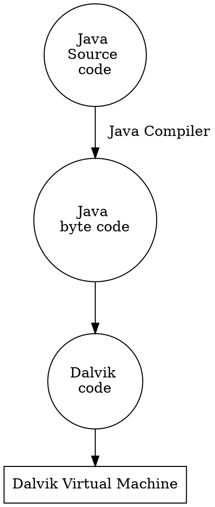

:::info
#### 23. The experimental Synthesis operating system has an assembler incorporated in the kernel. To optimize system-call performance, the kernel assembles routines within kernel space to minimize the path that the system call must take through the kernel. This approach is the antithesis(相反) of the layered approach, in which the path through the kernel is extended to make building the operating system easier. Discuss the pros and cons of the Synthesis approach to kernel design and system-performance optimization.
:::
(Synthesis OS 降低 kernel 到 syscall 之間的距離，和 layered approach 擴充 kernel path 的方法相反)<br><br>
(優點)
* kernel 到接收 syscall 的時間減短，有助於效能提升
* syscall 需要歷經的層數減少，overhead降低

(缺點)
* kernel 層數減少，降低 modify 和 debug 更難操作
---
# **Chapter 3 Processes**
:::success
#### 1. Using the program shown in Figure 3.30, explain what the output will be at LINE A.
```
#include <sys/types.h>
#include <stdio.h>
#include <unistd.h>
int value = 5;
int main()
{
pid t pid;
pid = fork();
if (pid == 0) { /* child process */
value += 15;
return 0;
}
else if (pid > 0) { /* parent process */
wait(NULL);
printf("PARENT: value = %d",value); /* LINE A */
return 0;
}
}
```
:::

parent 和 child process 相互獨立
<br>Ans : 5

:::success
#### 2. Including the initial parent process, how many processes are created by the program shown in Figure 3.31?
```
#include <stdio.h>
#include <unistd.h>
int main()
{
/* fork a child process */
fork();
/* fork another child process */
fork();
/* and fork another */
fork();
return 0;
}
```
:::
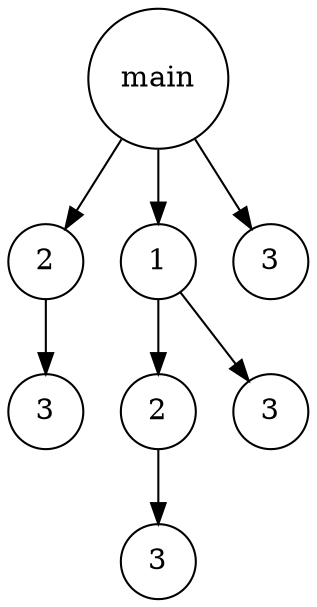
Ans : 8 processes

:::success
#### 3. Original versions of Apple’s mobile iOS operating system provided no means of concurrent processing. Discuss three major complications that concurrent processing adds to an operating system.
:::
* 設計嚴格的scheduling algorithm
* 設計 deadlock 和 race condition 機制，協調共享資源存取
* 考量需要多次context switch，避免 OS 超載

:::success
#### 4. Some computer systems provide multiple register sets. Describe what happens when a context switch occurs if the new context is already loaded into one of the register sets. What happens if the new context is in memory rather than in a register set and all the register sets are in use?
:::
register sets 可用於存取 new process 的狀態，當 process 取得 CPU 使用權時，可直接從 register sets 調用，以減短通訊時間，此方法常用於增進 context switch 的效能

:::success
#### 5. When a process creates a newprocess using the fork() operation, which of the following states is shared between the parent process and the child process?
```
a. Stack
b. Heap
c. Shared memory segments
```
:::
stack 和 heap 的資料得先存入 Shared memory segments，才能傳資料
<br>Ans : c

:::success
#### 6. Consider the “exactly once”semantic with respect to the RPC mechanism. Does the algorithm for implementing this semantic execute correctly even if the ACK message sent back to the client is lost due to a network problem? Describe the sequence of messages, and discuss whether “exactly once” is still preserved.
:::
(資網的範圍)<br>
若 message 回應超時，則再次發送請求；為考量 message 可能有 delayed 和 lost 兩種情形，"exactly once" 可保證資料的一致性，面對多次請求仍保持一致性

implement 要求:
<br>idempotence (冪等) : 重複的 resquest 不會導致錯誤，仍保持資料一致性
<br>identification (辨識) : 每個 message 都有各自的 id 進行辨識

:::success
#### 7. ~~Assume that a distributed system is susceptible to server failure. What mechanisms would be required to guarantee the “exactly once” semantic for execution of RPCs?~~
:::
:::success
#### 8. Describe the actions taken by a kernel to context-switch between processes.
:::
1. 因某些原因 old process 必須 waiting (e.g. waiting for I/O complete)
2. 儲存 old process 的 PCB 資訊到 register 或 memory
3. OS 載入 new process
4. 等到 old process waiting 結束，發送 interrupt 給 OS，將 CPU 使用權歸還並將其 PCB 資訊載回

:::success
#### ~~9. Construct a process tree similar to Figure 3.7. To obtain process informationfor the UNIX or Linux system, use the command ps -ael. Use the command man ps to get more information about the ps command. The task manager on Windows systems does not provide the parent process ID, but the process monitor tool, available from technet. microsoft.com, provides a process-tree tool.~~
:::
:::success
#### 10. Explain the role of the init (or systemd) process on UNIX and Linux systems in regard to process termination.
:::
init (systemd) 負責 shutdown 或 reboot 正在執行的 processes 進入終止程序，可發送正常終止訊號 (SIGTERM) 或強制終止訊號 (SIGKILL)，以此維護系統完整性

:::success
#### 11. Including the initial parent process, how many processes are created by the program shown in Figure 3.32?
```
#include <stdio.h>
#include <unistd.h>
int main()
{
int i;
for (i = 0; i < 4; i++)
fork();
return 0;
}
```
:::


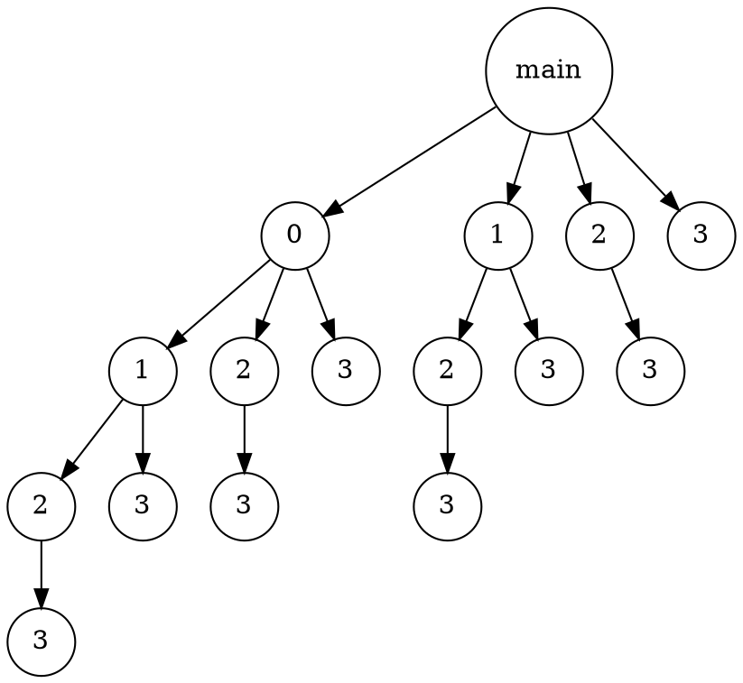
Ans : 16

:::success
#### 12. Explain the circumstances under which the line of code marked printf("LINE J") in Figure 3.33 will be reached.
```
#include <sys/types.h>
#include <stdio.h>
#include <unistd.h>
int main()
{
pid_t pid;
/* fork a child process */
pid = fork();
if (pid < 0) { /* error occurred */
fprintf(stderr, "Fork Failed");
return 1;
}
else if (pid == 0) { /* child process */
execlp("/bin/ls","ls",NULL);
printf("LINE J");
}
else { /* parent process */
/* parent will wait for the child to complete */
wait(NULL);
printf("Child Complete");
}
return 0;
}
```
:::
如果 fork() 正常執行，child process 的 pid 會被設為 0；反之，pid < 0，無法正常執行 child process

如果 execlp 正常執行，系統會調用 new process 覆蓋當前的 process，printf("LINE J")將無法執行

Ans : 
To receive the executing result of printf("LINE J"), there are two main circumstances:
1. fork() correctly executed and set the value pid == 0 without error.
2. execlp calls to fail.

:::success
#### 13. Using the program in Figure 3.34, identify the values of pid at lines A, B, C, and D. (Assume that the actual pids of the parent and child are 2600 and 2603, respectively.)
```
#include <sys/types.h>
#include <stdio.h>
#include <unistd.h>
int main()
{
pid_t pid, pid1;
/* fork a child process */
pid = fork();
if (pid < 0) { /* error occurred */
fprintf(stderr, "Fork Failed");
return 1;
}
else if (pid == 0) { /* child process */
pid1 = getpid();
printf("child: pid = %d",pid); /* A */
printf("child: pid1 = %d",pid1); /* B */
}
else { /* parent process */
pid1 = getpid();
printf("parent: pid = %d",pid); /* C */
printf("parent: pid1 = %d",pid1); /* D */
wait(NULL);
}
return 0;
}
```
:::
Ans : A=0, B=2603, C=2603, D=2600

:::success
#### 14. Give an example of a situation in which ordinary pipes are more suitable than named pipes and an example of a situation in which named pipes are more suitable than ordinary pipes.
:::
(ordinary pipes prefer) **補充 : 半雙工, 只能允許兩個有關連的 process 存取
* parent process 與 child process 之間的傳遞

(named pipes prefer) **補充 : 全雙工, 多個 process 可共用相同 pipe
*  messaging app 中許多 user 同時傳送 message

:::success
#### 15. ~~Consider the RPC mechanism. Describe the undesirable consequences that could arise from not enforcing either the “at most once” or “exactly once” semantic. Describe possible uses for a mechanism that has neither of these guarantees.~~
:::
:::success
#### 16. Using the program shown in Figure 3.35, explain what the output will be at lines X and Y.
```
#include <sys/types.h>
#include <stdio.h>
#include <unistd.h>
#define SIZE 5
int nums[SIZE] = {0,1,2,3,4};
int main()
{
int i;
pid t pid;
pid = fork();
if (pid == 0) {
for (i = 0; i < SIZE; i++) {
nums[i] *= -i;
printf("CHILD: %d ",nums[i]); /* LINE X */
}
}
else if (pid > 0) {
wait(NULL);
for (i = 0; i < SIZE; i++)
printf("PARENT: %d ",nums[i]); /* LINE Y */
}
return
```
:::
LINE X : 0, -1, -4, -9, -16 
<br>LINE Y : 0, 1, 2, 3, 4

:::success
#### 17. What are the benefits and the disadvantages of each of the following? Consider both the system level and the programmer level.
```
a. Synchronous and asynchronous communication
b. Automatic and explicit buffering
c. Send by copy and send by reference
d. Fixed-sized and variable-sized messages
```
:::
(a) 
* Synchronous allows endezvous between sender and receiver, while asynchronous does not allow this machanism
* asynchronous

(b)
*  Automatic buffering : message queue 的空間無限大，sender 可將 message 先放入佇列，不必進入 block
*  explicit buffering : message queue 的空間固定，當 sender 數量較多或傳送資料較大時，需要進入 block 機制，等待 queue 中的記憶體釋放

(c)
* send by copy : 原始資料不會被串改，適用於少量的資料傳輸。
* send by reference : 由於 recevier 接收的資料與原始資料位於相同 memory address，receiver 所做的動作可能改變原始資料，適用於傳送大量資料。

(d)
* Fixed-sized : buffer area 可以事先得知資料大小，有利於記憶體分配，適用於 message passing 的傳送式
* variable-sized : buffer area 無法事先得知資料大小，適用 shared memory 的傳送方式
:::success
#### 18. Using either a UNIX or a Linux system, write a C program that forks a child process that ultimately becomes a zombie process. This zombie process must remain in the system for at least 10 seconds. Process states can be obtained from the command<br><br>&ensp;&ensp;&ensp;&ensp;&ensp;<i>ps -l</i><br><br> The process states are shown below the S column; processes with a state of Z are zombies. The process identifier (pid) of the child process is listed in the PID column, and that of the parent is listed in the PPID column. <br>&ensp;&ensp;&ensp;Perhaps the easiest way to determine that the child process is indeed a zombie is to run the program that you have written in the background (using the &) and then run the command ps -l to determine whether the child is a zombie process. Because you do notwant too many zombie processes existing in the system, you will need to remove the one that you have created. The easiest way to do that is to terminate the parent process using the kill command. For example, if the pid of the parent is 4884, you would enter<br><br>&ensp;&ensp;&ensp;&ensp;&ensp;<i>kill -9 4884</i>
:::
(寫一個code, 造出zombie process)
<br>Coding answer : 
```
#include <stdio.h>
#include <stdlib.h>
#include <sys/types.h>
#include <unistd.h>
#include <sys/wait.h>

int main() {
    pid_t child_pid;

    child_pid = fork();

    if (child_pid < 0) {
        perror("Fork failed");
        exit(1);
    } else if (child_pid == 0) {
        exit(0);
        
    } else {
        sleep(10);
        
        system("ps -l"); //test child process is zombie

        kill(getpid(), SIGKILL); //shutdown parent process to close child process
    }
    return 0;
}
```
---
# **Chapter 4 Threads & Concurrency**
:::success
#### 1. Provide three programming examples in which multithreading provides better performance than a single-threaded solution.
:::
1. 矩陣運算
2. 圖像處理
3. server 處理多用戶請求
:::success
#### 2. Using Amdahl’s Law, calculate the speedup gain of an application that has a 60 percent parallel component for (a) two processing cores and (b) four processing cores.
:::
$$
a.  \quad  speedup = {1 \over {0.6 \over 2}+0.4}={1  \over 0.7} \approx 1.4257
$$
$$
b.  \quad  speedup = {1 \over {0.6 \over 4}+0.4}={1  \over 0.55} \approx 1.8182
$$

:::success
#### 3. Does the multithreaded web server described in Section 4.1 exhibit task or data parallelism?
:::
Yes, thread 可做平行處理

:::success
#### 4. What are two differences between user-level threads and kernel-level threads? Under what circumstances is one type better than the other?
:::
(user thread 和 kernel thread 本來就很難鑑別，讀不懂很正常)<br><br>
User-Level threads 不須由 syscall 生成，可直接在 user mode 執行，甚少在執行過程中使用 syscall，無法由OS 控制和管理

* User-level thread 由應用程式管理和創建，context switch 非常快速，適用於處裡 CPU-bound tasks 和高度依賴運算的 process
* Kernel-level thread 能夠調整自身的使用資源，避免 thread 閒置，適用於處理 I/O-bound tasks (常常需要等待 I/O completion)

:::success
#### 5. Describe the actions taken by a kernel to context-switch between kernellevel threads.
:::
可分為在相同 process 或者不同 process 的 context switch (以前者為例)
1. 儲存 TCB 至共同 process 的記憶體空間
2. 載入新 thread 至核心執行

:::success
#### 6. What resources are used when a thread is created? How do they differ from those used when a process is created?
:::
* thread creation : 分配一個很小的空間，用於儲存 stack, register set, PC, thread id etc.
* process creation : 需要很大的空間儲存 PCB 資訊，以及 open file, momery map, code etc. 創建準備的時間也較長
:::success
#### 7. Assume that an operating system maps user-level threads to the kernel using the many-to-many model and that the mapping is done through LWPs. Furthermore, the system allows developers to create real-time threads for use in real-time systems. Is it necessary to bind a real-time thread to an LWP? Explain.
:::
(這個好難我不會, 下面是 chegg 的解答) /idk<br> 
off course Yes, otherwise a user thread may have to compete for an available LWP prior to being actually scheduled. By binding the user thread to an LWP, there is no latency while waiting for an available LWP; the real-time user thread can be scheduled immediately. Also the OS can assign a high priority to such a thread so that it can receive real-time servicing.
:::success
#### 8. Provide two programming examples in which multithreading does not provide better performance than a single-threaded solution.
:::
1. sequence program 的執行 (不能被 divided, 不能 parallel 執行)
2. A C shell program 密切監控工作環境
:::success
#### 9. Under what circumstances does a multithreaded solution using multiple kernel threads provide better performance than a single-threaded solution on a single-processor system?
:::
當其中一個 thread 發出 I/O request，OS 可將 CPU 切換給其他 thread 使用，而非切換給其他 process
:::success
#### 10. Which of the following components of program state are shared across threads in a multithreaded process?
```
a. Register values
b. Heap memory
c. Global variables
d. Stack memory
```
:::
Ans : b, c
:::success
#### 11. Can a multithreaded solution using multiple user-level threads achieve better performance on a multiprocessor system than on a single-processor system? Explain.
:::
multiple user thread 會被 OS 視為 single thread (OS 沒辦法監控 user thread)，這些執行緒無法在多處理器上進行有效調度

**解決方法 : 使用 one-to-one 或 one-to-many 讓 user threads 能夠在不同 core 上執行
:::success
#### 12. In Chapter 3, we discussed Google’s Chrome browser and its practice of opening each new tab in a separate process. Would the same benefits have been achieved if, instead, Chrome had been designed to open each new tab in a separate thread? Explain.
:::
沒有任何好處, 使用不同 process 維持各個 tab, 是為了避免 tab 發生錯誤, 會影響到其他 tab 的執行

(From chegg)<br>
One cannot maintain the efficiency of the browser while opening each new website as a thread, because threads are allocated with shared memory spaces. Hence they may affect each other if one of them crashes unexpectedly.
:::success
#### 13. Is it possible to have concurrency but not parallelism? Explain.
:::
Yes,
* concurrency 能夠快速切換不同 process, 快到覺得它們是一起執行
* parallel 多個 process 能夠在同一時間一起執行，硬體上必須使用多核心處理器，或多處理器 CPU 才能實作技術
:::success
#### 14. Using Amdahl’s Law, calculate the speedup gain for the following applications:
```
• 40 percent parallel with (a) eight processing cores and (b) sixteen processing cores
• 67 percent parallel with (a) two processing cores and (b) four processing cores
• 90 percent parallel with (a) four processing cores and (b) eight processing cores
```
:::
$$
a.  \quad  speedup = {1 \over {0.4 \over 8}+0.6}={1  \over 0.65} \approx 1.5385\quad\quad b.  \quad  speedup = {1 \over {0.4 \over 60}+0.6}={1  \over 0.6067} \approx 1.6483 \\
$$
$$
a.  \quad  speedup = {1 \over {0.67 \over 2}+0.33}={1  \over 0.665} \approx 1.5038\quad\quad b.  \quad  speedup = {1 \over {0.67 \over 4}+0.33}={1  \over 0.4925} \approx 2.0305 \\
$$
$$
a.  \quad  speedup = {1 \over {0.9 \over 4}+0.1}={1  \over 0.325} \approx 3.0769\quad\quad b.  \quad  speedup = {1 \over {0.9 \over 8}+0.1}={1  \over 0.2125} \approx 4.7059
$$

:::success
#### 15. Determine if the following problems exhibit task or data parallelism:
```
• Using a separate thread to generate a thumbnail for each photo in a
collection
• Transposing a matrix in parallel
• A networked application where one thread reads from the network
and another writes to the network
• The fork-join array summation application described in Section 4.5.2
• The Grand Central Dispatch system
```
:::
1. task parallelism
2. data parallelism
3. task parallelism
4. data parallelism //idk
5. task parallelism
:::success
#### 16. A system with two dual-core processors has four processors available for scheduling. A CPU-intensive application is running on this system. All input is performed at program start-up, when a single file must beopened. Similarly, all output is performed just before the program terminates, when the program results must bewritten to a single file. Between start-up and termination, the program is entirely CPU-bound. Your task is to improve the performance of this application by multithreading it. The application runs on a system that uses the one-to-one threading model (each user thread maps to a kernel thread).
```
• How many threads will you create to perform the input and output?
Explain.
• How many threads will you create for the CPU-intensive portion of
the application? Explain.
```
:::
1. only one thread is needed, 輸入和輸出僅需在程式啟動和終止各執行一次
2. 4 thread, CPU 密集型工作的執行會受到 CPU 限制，所以 thread 的數量取決於 core 數量，此外，one-to-one model 也保證 multi-user thread 能夠受 OS 有效調度，提升整體效能
:::success
#### 17. Consider the following code segment:
```
pid_t pid;
pid = fork();
if (pid == 0) { /* child process */
fork();
thread create( . . .);
}
fork();

a. How many unique processes are created?
b. How many unique threads are created?
```
:::
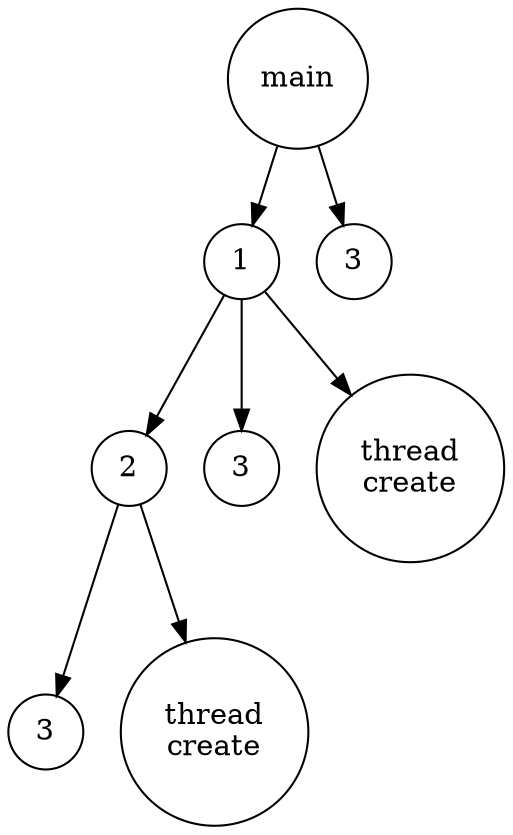
Ans : (a) 6；(b) 8

:::success
#### 18. As described in Section 4.7.2, Linux does not distinguish between processes and threads. Instead, Linux treats both in the same way, allowing a task to be more akin to a process or a thread depending on the set of flags passed to the clone() system call. However, other operating systems, such asWindows, treat processes and threads differently. Typically, such systems use a notation in which the data structure for a process contains pointers to the separate threads belonging to the process. Contrast these two approaches for modeling processes and threads within the kernel.
:::
* Window : process 和 thread 有明確的區分，thread 不能單獨存在，必須依附於某個 process，threads 能夠共享共同 process 內的資源
* linux : process 和 thread 都視為 task，可透過 "clone()" syscall 建立，並指定標籤決定 task 的行為，一種是共享相同的記憶體空間(類似於 thread)，另一種是獨立的記憶體空間(類似於 process)，在管理更加具有靈活且能減少 overhead
:::success
#### 19. The program shown in Figure 4.23 uses the Pthreads API. What would be the output from the program at LINE C and LINE P?
```
#include <pthread.h>
#include <stdio.h>
int value = 0;
void *runner(void *param); /* the thread */
int main(int argc, char *argv[])
{
    pid t pid;
    pthread t tid;
    pthread attr t attr;
    pid = fork();
    if (pid == 0) { /* child process */
        pthread attr init(&attr);
        pthread create(&tid,&attr,runner,NULL);
        pthread join(tid,NULL);
        printf("CHILD: value = %d",value); /* LINE C */
    }
    else if (pid > 0) { /* parent process */
        wait(NULL);
        printf("PARENT: value = %d",value); /* LINE P */
    }
}

void *runner(void *param) {
    value = 5;
    pthread exit(0);
}
```
:::
Ans : 
* child : value = 5
* parent : value = 0

:::success
#### 20. Consider a multicore system and a multithreaded program written using the many-to-many threading model. Let the number of user-level threads in the program be greater than the number of processing cores in the system. Discuss the performance implications of the following scenarios.
```
a. The number of kernel threads allocated to the program is less than
the number of processing cores.
b. The number of kernel threads allocated to the program is equal to
the number of processing cores.
c. The number of kernel threads allocated to the program is greater
than the number of processing cores but less than the number of
user-level threads.
```
:::
a. CPU 使用率不佳，會有 processor(s) idle <br>
b. CPU 使用率佳，所有核心都能有效利用，但有 thread 發生 block 時，kernel thread 不夠與所有 core 溝通，造成 processor(s) idle <br>
c. CPU 使用率佳，所有核心都能也校利用，一旦有 thread 發生 block 時，可馬上切換給其他 thread 使用，防止 CPU idle

:::success
#### ~~21. Pthreads provides an API for managing thread cancellation. The pthread setcancelstate() function is used to set the cancellation state. Its prototype appears as follows: <br><br>&ensp;&ensp;&ensp;&ensp;&ensp;<i>pthread setcancelstate(int state, int *oldstate)</i><br><br>The two possible values for the state are PTHREAD CANCEL ENABLE and PTHREAD CANCEL DISABLE. Using the code segment shown in Figure 4.24, provide examples of two operations that would be suitable to perform between the calls to disable and enable thread cancellation.~~
```
int oldstate;
pthread setcancelstate(PTHREAD CANCEL DISABLE, &oldstate);
/* What operations would be performed here? */
pthread setcancelstate(PTHREAD CANCEL ENABLE, &oldstate);
```
:::

---
# **Chapter 5 CPU Scheduling**

:::success
#### 1. A CPU-scheduling algorithm determines an order for the execution of its scheduled processes. Given n processes to be scheduled on one processor, how many different schedules are possible? Give a formula in terms of n.
:::
Ans : n!

:::success
#### 2. Explain the difference between preemptive and nonpreemptive scheduling.
:::
* preeptive : OS 能夠發送 interrupt 終止正在執行的 process，將資源切換給其他優先權較高的 process 使用。
* nonpreemptive : 保證每個 process 都能擁有 CPU 使用權直到字元釋放資源為止，不允許 process 插隊 

**補充 : 只要能支援 time-out, interrupt other process(process interrupt 自己不算), RR 都是 preemptive scheduling<br>
**爭議 : 判斷 preemptive 有 2 種觀點，一種是 process 還沒完成工作前是否有別的 process 取得 CPU 資源；另一種是 CPU 資源是否是 process 自願釋放 (我是比較支持這種，所以我把 I/O request 定義成 non-preemptive 可接受的機制)

:::success
#### 3. Suppose that the following processes arrive for execution at the times indicated. Each processwill run for the amount of time listed. In answering the questions, use nonpreemptive scheduling, and base all decisions on the information you have at the time the decision must be made.
\begin{array}
\text{Process} &&& \text{Arrival Time} &&& \text{Burst Time} \\
\hline
\text{P1} &&& \text{0.0} &&& \text{8} \\
\text{P2} &&& \text{0.4} &&& \text{4} \\
\text{P3} &&& \text{1.0} &&& \text{1} \\
\end{array}
```
a. What is the average turnaround time for these processes with the FCFS scheduling 
algorithm?
b. What is the average turnaround time for these processes with the SJF scheduling 
algorithm?
c. The SJF algorithm is supposed to improve performance, but notice that we chose 
to run process P1 at time 0 because we did not know average turnaround time will be 
if the CPU is left idle for the first 1 unit and then SJF scheduling is used. 
Remember that processes P1 and P2 are waiting during this idle time, so their 
waiting time may increase. This algorithm could be known as future-knowledge 
scheduling.
```
:::
(a)
```mermaid
gantt
    title FCFS
    dateFormat X
    axisFormat %s
    section P1
    8   : 0, 8 
    section P2
    4   : 8, 12
    section P3
    1   : 12, 13
```
$$
a.  \quad  average\ turnaround\ time = {8 + 11.6 + 12 \over 3}={31.6  \over 3} \approx 10.5333
$$
(b)
```mermaid
gantt
    title SJF
    dateFormat X
    axisFormat %s
    section P1
    8   : 0, 8 
    section P2
    4   : 9, 13
    section P3
    1   : 8, 9
```
$$
b.  \quad  average\ turnaround\ time = {14 + 5.6 + 8 \over 3}={28.6  \over 3} \approx 9.5333
$$
\(c\)
```mermaid
gantt
    title SJF
    dateFormat X
    axisFormat %s
    section CPU idle
    1   : 0, 1
    section P1
    8   : 6, 14 
    section P2
    4   : 2, 6
    section P3
    1   : 1, 2
```
$$
c.  \quad  average\ turnaround\ time = {14 + 5.6 + 1 \over 3}={20.6  \over 3} \approx 2.8667
$$

:::success
#### 4. Consider the following set of processes, with the length of the CPU burst time given in milliseconds:
\begin{array}
\text{Process} &&& \text{Burst Time} &&& \text{Priority} \\
\hline
\text{P1} &&& \text{2} &&& \text{2} \\
\text{P2} &&& \text{1} &&& \text{1} \\
\text{P3} &&& \text{8} &&& \text{4} \\
\text{P4} &&& \text{4} &&& \text{2} \\
\text{P5} &&& \text{5} &&& \text{3} \\
\end{array}
    <b>The processes are assumed to have arrived in the order P1, P2, P3, P4, P5, all at time 0.</b>
```
a. Draw four Gantt charts that illustrate the execution of these processes
using the following scheduling algorithms: FCFS, SJF, nonpreemptive
priority (a larger priority number implies a higher
priority), and RR (quantum = 2).
b. What is the turnaround time of each process for each of the
scheduling algorithms in part a?
c. What is the waiting time of each process for each of these scheduling
algorithms?
d. Which of the algorithms results in the minimum average waiting
time (over all processes)?
```
:::
(a)
```mermaid
gantt
    title FCFS
    dateFormat X
    axisFormat %s
    section P1
    2   : 0, 2 
    section P2
    1   : 2, 3
    section P3
    8   : 3, 11 
    section P4
    4   : 11, 15
    section P5
    5   : 15, 20
```
```mermaid
gantt
    title SJF
    dateFormat X
    axisFormat %s
    section P1
    2   : 1, 3 
    section P2
    1   : 0, 1
    section P3
    8   : 12, 20 
    section P4
    4   : 3, 7
    section P5
    5   : 7, 12
```
```mermaid
gantt
    title nonpreemptive priority 
    dateFormat X
    axisFormat %s
    section P1
    2   : 13, 15 
    section P2
    1   : 19, 20
    section P3
    8   : 0, 8 
    section P4
    4   : 15, 19
    section P5
    5   : 8, 13
```
```mermaid
gantt
    title Round Rubin
    dateFormat X
    axisFormat %s
    section P1
    2   : 0, 2 
    section P2
    1   : 2, 3
    section P3
    2   : 3, 5
    2   : 9, 11
    2   : 15, 17
    2   : 18, 20
    section P4
    2   : 5, 7
    2   : 11, 13
    section P5
    2   : 7, 9
    2   : 13, 15
    1   : 17, 18
```
(b) turnaround time <br>
\begin{array}
\text{Process} &&& \text{FCFS} &&& \text{SJF} &&& \text{Priority} &&& \text{RR}\\
\hline
\text{P1} &&& \text{2} &&& \text{3} &&& \text{15} &&& \text{2}\\
\text{P2} &&& \text{3} &&& \text{1} &&& \text{20} &&& \text{3}\\
\text{P3} &&& \text{11} &&& \text{20} &&& \text{8} &&& \text{20}\\
\text{P4} &&& \text{15} &&& \text{7} &&& \text{19} &&& \text{13}\\
\text{P5} &&& \text{20} &&& \text{12} &&& \text{13} &&& \text{18}\\
\end{array}

\(c\) waiting time
\begin{array}
\text{Process} &&& \text{FCFS} &&& \text{SJF} &&& \text{Priority} &&& \text{RR}\\
\hline
\text{P1} &&& \text{0} &&& \text{1} &&& \text{13} &&& \text{0}\\
\text{P2} &&& \text{2} &&& \text{0} &&& \text{19} &&& \text{2}\\
\text{P3} &&& \text{3} &&& \text{12} &&& \text{0} &&& \text{12}\\
\text{P4} &&& \text{11} &&& \text{3} &&& \text{15} &&& \text{9}\\
\text{P5} &&& \text{15} &&& \text{7} &&& \text{8} &&& \text{13}\\
\end{array}
(d) SJF average waiting time 最短
:::success
#### 5. The following processes are being scheduled using a preemptive, round robin scheduling algorithm.
\begin{array}
\text{Process} &&& \text{Priority} &&& \text{Burst} &&& \text{Arrival}\\
\hline
\text{P1} &&& \text{40} &&& \text{20} &&& \text{0}\\
\text{P2} &&& \text{30} &&& \text{25} &&& \text{25}\\
\text{P3} &&& \text{30} &&& \text{25} &&& \text{30}\\
\text{P4} &&& \text{35} &&& \text{15} &&& \text{60}\\
\text{P5} &&& \text{5} &&& \text{10} &&& \text{100}\\
\text{P5} &&& \text{10} &&& \text{10} &&& \text{105}\\
\end{array}
    <font size=3><b>Each process is assigned a numerical priority,with a higher number indicating a higher relative priority. In addition to the processes listed below, the system also has an idle task (which consumes no CPU resources and is identified as Pidle). This task has priority 0 and is scheduled whenever the system has no other available processes to run. The length of a time quantum is 10 units. If a process is preempted by a higher-priority process, the preempted process is placed at the end of the queue.</font></b>
```
a. Show the scheduling order of the processes using a Gantt chart.
b. What is the turnaround time for each process?
c. What is the waiting time for each process?
d. What is the CPU utilization rate?
```
:::
(a)
```mermaid
gantt
    title Priority Round Rubin
    dateFormat X
    axisFormat %s
    section idle
    5   : 20, 25
    10  : 90, 100
    section P1
    20   : 0, 10
    section P2
    10   : 25, 35
    10   : 45, 55
    5   : 75, 80
    section P3
    10   : 35, 45
    5   : 55, 60
    10   : 80, 90
    section P4
    15   : 60, 75
    section P5
    5   : 100, 105
    5   : 115, 120
    section P6
    10   : 105, 115
```

(b) turnaround time <br>
\begin{array}
\text{P1} &&& \text{P2} &&& \text{P3} &&& \text{P4} &&& \text{P5} &&& \text{P6}\\
\hline
\text{20} &&& \text{55} &&& \text{60} &&& \text{15} &&& \text{20} &&& \text{10}\\
\end{array}

\(c\) waiting time  (turnaround - CPU burst)
\begin{array}
\text{P1} &&& \text{P2} &&& \text{P3} &&& \text{P4} &&& \text{P5} &&& \text{P6}\\
\hline
\text{0} &&& \text{30} &&& \text{35} &&& \text{0} &&& \text{10} &&& \text{0}\\
\end{array}
(d) CPU utilization rate = 105/120 = 0.875
:::success
#### 6. What advantage is there in having different time-quantum sizes at different levels of a multilevel queueing system?
:::
* 將不同類型的 process 進入不同 priority queue，有效使用調度系統，例如 : Batch process 放入低優先權佇列；real-time process 放入高優先權佇列
* 減少 context switch、減少 waiting time，例如 : 當所有 process 都在競爭 CPU 資源，可能導致 context switch 較為頻繁。但在 multilevel queue 中，進程被分成多個隊列，只有相同 queue 中的 process 才會競爭 CPU，以此降低 context switch。
:::success
#### 7. Many CPU-scheduling algorithms are parameterized. For example, the RR algorithm requires a parameter to indicate the time slice. Multilevel feedback queues require parameters to define the number of queues, the scheduling algorithms for each queue, the criteria used to move processes between queues, and so on. <br>&ensp;&ensp;&ensp;These algorithms are thus really sets of algorithms (for example, the set of RR algorithms for all time slices, and so on). One set of algorithms may include another (for example, the FCFS algorithm is the RR algorithm with an infinite time quantum). What (if any) relation holds between the following pairs of algorithm sets?
```
a. Priority and SJF
b. Multilevel feedback queues and FCFS
c. Priority and FCFS
d. RR and SJF
```
:::
a. 越短的 job，priority 越高 <br>
b. multilevel feedback queue 最後一個佇列是採用 FCFS <br>
c. 先到的 job，priority 越高 <br>
d. none
:::success
#### 8. Suppose that a CPU scheduling algorithm favors those processes that have used the least processor time in the recent past. Why will this algorithm favor I/O-bound programs and yet not permanently starve CPU-bound programs?
:::
I/O-bound program 所需的 CPU 時間較短，通常都是頻繁處理 I/O job，所需的 CPU 時間較短，不會與 CPU-bound program 競爭資源

:::success
#### 9. Distinguish between PCS and SCS scheduling.
:::
* PCS(優先權調度) : 為每個 process 賦予權值，priority 較高者可優先取得 CPU 使用權。目的在於可優先將資源分配給重要或緊急的 process 使用
* SCS(短時間調度) : short job 可優先取得 CPU 使用權，目的在於減少整體 waiting time
:::success
#### 10. The traditional UNIX scheduler enforces an inverse relationship between priority numbers and priorities: the higher the number, the lower the priority. The scheduler recalculates process priorities once per second using the following function: Priority = (recent CPU usage / 2) + base where base = 60 and recent CPU usage refers to a value indicating how often a process has used the CPU since priorities were last recalculated. Assume that recent CPU usage for process P1 is 40, for process P2 is 18, and for process P3 is 10. What will be the new priorities for these three processes when priorities are recalculated? Based on this information, does the traditional UNIX scheduler raise or lower the relative priority of a CPU-bound process?
:::
1. priority 分別為 : P1=80, P2=69, P3=65
2. 此 scheduler 降低 CPU-bound 的權值
:::success
#### 11. Of these two types of programs:<br><br>&ensp;&ensp;&ensp;&ensp;&ensp;<i>a. I/O-bound<br><br>&ensp;&ensp;&ensp;&ensp;&ensp;b. CPU-bound</i><br><br>which is more likely to have voluntary context switches, and which is more likely to have nonvoluntary context switches? Explain your answer.
:::
* I/O-bound 花費許多時間與使用者或周邊設備溝通，在等待 I/O 完成的期間，CPU 處於 idle 狀態，可將 CPU 切換給其他 process 使用，因此為 voluntary context switches
* CPU-bound 需要大量的 CPU 資源來完成工作，傾向於獨佔 CPU 資源，所以需要 scheduler 幫忙安排行程，強迫 process 釋放資源給其他 process 使用，以達到公平的目的，因此為 nonvoluntary context switches
:::success
#### 12. Discuss how the following pairs of scheduling criteria conflict in certain settings.
```
a. CPU utilization and response time
b. Average turnaround time and maximum waiting time
c. I/O device utilization and CPU utilization
```
:::
(想個理由為何會有衝突)<br><br>
(a) 提升 CPU 使用率，可透過增加 process 可使用的最長時間，減少 context switch，然而，這將導致 user program 的回應時間拉長。例如 : 在 time-sharing system，追求 CPU 使用率可能會造成與 user 的 response time 下降，因 batch process 可占用更多 CPU time
<br><br>
(b) SJF scheduling 可優先讓 short job 取得 CPU 使用權，減少 average turnaround time，但 long job 必須等待非常久的時間，才能取得 CPU，增加了 maximum waiting time </br><br>
\(c\) CPU 執行 I/O-bound 可利用等待 I/O 的時間執行其他 process，雖然減少 CPU idle，但也使得 context switch 變得頻繁
:::success
#### 13. One technique for implementing lottery schedulingworks by assigning processes lottery tickets, which are used for allocating CPU time.Whenever a scheduling decision has to be made, a lottery ticket is chosen at random, and the process holding that ticket gets the CPU. The BTV operating system implements lottery scheduling by holding a lottery 50 times each second, with each lottery winner getting 20 milliseconds of CPU time (20 milliseconds × 50 = 1 second). Describe how the BTV scheduler can ensure that higher-priority threads receive more attention from the CPU than lower-priority threads.
:::
(將分彩票給 process / thread，每個 process / thread 不限於獲得一張，可擁有多張彩票)<br>
* 分配固定數量的彩票給每個 process 或 thread，且高優先權 process 可分得更多彩票，以增加高優先權 process 獲得 CPU 使用權的機會
* 儘管低優先權 process 仍有低機率獲得 CPU 資源，但獲獎者最大能使用的時間為 20ms，輪到下一次抽獎，高優先權 process 仍有高機率獲取 CPU 使用權。
:::success
#### 14. Most scheduling algorithms maintain a run queue,which lists processes eligible to run on a processor. On multicore systems, there are two general options: (1) each processing core has its own run queue, or (2) a single run queue is shared by all processing cores. What are the advantages and disadvantages of each of these approaches?
:::
(1)
* 優點 : 因為每個 core 都有自己的 run queue，所以在存取佇列時不會發生爭奪
* 缺點 : 負載不平衡、設計較複雜(同步機制)

(2) 
* 優點 : 負載平衡、公平性
* 缺點 : 多個 core 會爭奪共同的 run queue 
:::success
#### 15. Consider the exponential average formula used to predict the length of the next CPU burst. What are the implications of assigning the following values to the parameters used by the algorithm?
```
a. α = 0 and τ0 = 100 milliseconds
b. α = 0.99 and τ0 = 10 milliseconds
```
:::
$$
formula : t_n = (1-α)τ_{n-1}+αt_{n-1}
$$
(a) 預測結果完全由上一個預測結果決定, Ans : 100ms <br>
(b) 預測結果幾乎由上一個 process 的 CPU burst time 決定
:::success
#### 16. A variation of the round-robin scheduler is the regressive round-robin scheduler. This scheduler assigns each process a time quantum and a priority. The initial value of a time quantum is 50 milliseconds.However, every time a process has been allocated the CPU and uses its entire time quantum (does not block for I/O), 10 milliseconds is added to its time quantum, and its priority level is boosted. (The time quantum for a process can be increased to a maximum of 100 milliseconds.) When a process blocks before using its entire time quantum, its time quantum is reduced by 5 milliseconds, but its priority remains the same. What type of process (CPU-bound or I/O-bound) does the regressive round-robin scheduler favor? Explain.
:::
此排程方法有利於 CPU-bound process, 每當使用完當前的 time quantum，就能獲得更長的 CPU 使用時間並提高優先權；而I/O-bound process 所需的 CPU time 非常短，且時常需要被 block 等待 I/O，每次 block 將減少 5ms 的 CPU 使用時間，可分配更多時間給 CPU-bound process 使用
:::success
#### 17. Consider the following set of processes, with the length of the CPU burst given in milliseconds:
\begin{array}
\text{Process} &&& \text{Burst Time} &&& \text{Priority} \\
\hline
\text{P1} &&& \text{5} &&& \text{4} \\
\text{P2} &&& \text{3} &&& \text{1} \\
\text{P3} &&& \text{1} &&& \text{2} \\
\text{P4} &&& \text{7} &&& \text{2} \\
\text{P5} &&& \text{4} &&& \text{3} \\
\end{array}
<font size=3><b>The processes are assumed to have arrived in the order P1, P2, P3, P4, P5, all at time 0.</b></font>
```
a. Draw four Gantt charts that illustrate the execution of these processes
using the following scheduling algorithms: FCFS, SJF, nonpreemptive
priority (a larger priority number implies a higher
priority), and RR (quantum = 2).
b. What is the turnaround time of each process for each of the
scheduling algorithms in part a?
c. What is the waiting time of each process for each of these scheduling
algorithms?
d. Which of the algorithms results in the minimum average waiting
time (over all processes)?
```
:::
(a)
```mermaid
gantt
    title FCFS
    dateFormat X
    axisFormat %s
    section P1
    5   : 0, 5
    section P2
    3   : 5, 8
    section P3
    1   : 8, 9
    section P4
    7   : 9, 16
    section P5
    4   : 16, 20
```
```mermaid
gantt
    title SJF
    dateFormat X
    axisFormat %s
    section P1
    5   : 8, 13
    section P2
    3   : 1, 4
    section P3
    1   : 0, 1
    section P4
    7   : 13, 20
    section P5
    4   : 4, 8
```
```mermaid
gantt
    title nonpreemptive priority
    dateFormat X
    axisFormat %s
    section P1
    5   : 0, 5
    section P2
    3   : 17, 20
    section P3
    1   : 9, 10
    section P4
    7   : 10, 17
    section P5
    4   : 5, 9
```
```mermaid
gantt
    title RR
    dateFormat X
    axisFormat %s
    section P1
    2   : 0, 2
    2   : 9, 11
    1   : 16, 17
    section P2
    2   : 2, 4
    1   : 11, 12
    section P3
    1   : 4, 5
    section P4
    2   : 5, 7
    2   : 12, 14
    2   : 17, 19
    1   : 19, 20
    section P5
    2   : 7, 9
    2   : 14, 16
```
(b) turnaround time
\begin{array}
\text{Process} &&& \text{FCFS} &&& \text{SJF} &&& \text{Priority} &&& \text{RR}\\
\hline
\text{P1} &&& \text{5} &&& \text{13} &&& \text{5} &&& \text{17}\\
\text{P2} &&& \text{8} &&& \text{4} &&& \text{20} &&& \text{12}\\
\text{P3} &&& \text{9} &&& \text{1} &&& \text{10} &&& \text{5}\\
\text{P4} &&& \text{16} &&& \text{20} &&& \text{17} &&& \text{20}\\
\text{P5} &&& \text{20} &&& \text{8} &&& \text{9} &&& \text{16}\\
\end{array}

\(c\) waiting time
\begin{array}
\text{Process} &&& \text{FCFS} &&& \text{SJF} &&& \text{Priority} &&& \text{RR}\\
\hline
\text{P1} &&& \text{0} &&& \text{8} &&& \text{0} &&& \text{12}\\
\text{P2} &&& \text{5} &&& \text{1} &&& \text{17} &&& \text{9}\\
\text{P3} &&& \text{8} &&& \text{0} &&& \text{9} &&& \text{4}\\
\text{P4} &&& \text{9} &&& \text{13} &&& \text{10} &&& \text{13}\\
\text{P5} &&& \text{16} &&& \text{4} &&& \text{5} &&& \text{12}\\
\end{array}

(d) SJF average waiting time 最短

:::success
#### 18. The following processes are being scheduled using a preemptive, priority-based, round-robin scheduling algorithm.
\begin{array}
\text{Process} &&& \text{Priority} &&& \text{Burst} &&& \text{Arrival}\\
\hline
\text{P1} &&& \text{8} &&& \text{15} &&& \text{0}\\
\text{P2} &&& \text{3} &&& \text{20} &&& \text{0}\\
\text{P3} &&& \text{4} &&& \text{20} &&& \text{20}\\
\text{P4} &&& \text{4} &&& \text{20} &&& \text{25}\\
\text{P5} &&& \text{5} &&& \text{5} &&& \text{45}\\
\text{P5} &&& \text{5} &&& \text{15} &&& \text{55}\\
\end{array}
    <font size=3><b>Each process is assigned a numerical priority,with a higher number indicating a higher relative priority. The scheduler will execute the highestpriority process. For processes with the same priority, a round-robin scheduler will be used with a time quantum of 10 units. If a process is preempted by a higher-priority process, the preempted process is placed at the end of the queue.</b></font>
```
a. Show the scheduling order of the processes using a Gantt chart.
b. What is the turnaround time for each process?
c. What is the waiting time for each process?
```
:::
(a)
```mermaid
gantt
    title preemptive, priority-based, round-robin
    dateFormat X
    axisFormat %s
    section P1
    15   : 0, 15
    section P2
    5   : 15, 20
    15   : 80, 95
    section P3
    10   : 20, 30
    5   : 40, 45
    5   : 50, 55
    section P4
    10   : 30, 40
    10   : 70, 80
    section P5
    5   : 45, 50
    section P6
    15   : 55, 70
```
(b) turnaround time
\begin{array}
\text{P1} &&& \text{P2} &&& \text{P3} &&& \text{P4} &&& \text{P5} &&& \text{P6}\\
\hline
\text{15} &&& \text{95} &&& \text{35} &&& \text{55} &&& \text{5} &&& \text{15}\\
\end{array}

\(c\) waiting time
\begin{array}
\text{P1} &&& \text{P2} &&& \text{P3} &&& \text{P4} &&& \text{P5} &&& \text{P6}\\
\hline
\text{0} &&& \text{75} &&& \text{15} &&& \text{35} &&& \text{0} &&& \text{0}\\
\end{array}

:::success
#### 19. The nice command is used to set the nice value of a process on Linux, as well as on other UNIX systems. Explain why some systems may allow any user to assign a process a nice value >= 0 yet allow only the root (or administrator) user to assign nice values < 0.
:::
nice command 可用於調整 process 的 priority，nice value > 0 可用於減少行程的權值，nice value < 0 可用於增加行程的權值 (root 才能用)，其設計原因如下 :

* 公平性 (fairness) : 允許 user 將 process 的權值降低，將非急迫的 process 延後執行
* 防止濫用 (prevent abuse) : 防止使用者任意提高 process 的權值，影響系統效能
* 安全性 (security) : 防止惡意操縱 process 的優先權，損壞系統運作

**補充 (chegg)
If all users are allowed to increase process's priority, it may be used to form a DoS attack when important processes are starved to get the CPU, while malicious processes are given higher priority.

:::success
#### 20 Which of the following scheduling algorithms could result in starvation?
```
a. First-come, first-served
b. Shortest job first
c. Round robin
d. Priority
```
:::
priority 導致低優先權 process 長期無法取得 CPU 資源<br>
Ans : d

:::success
#### 21. Consider a variant of the RR scheduling algorithm in which the entries in the ready queue are pointers to the PCBs.
```
a. What would be the effect of putting two pointers to the same
process in the ready queue?
b. What would be two major advantages and two disadvantages of
this scheme?
c. Howwould youmodify the basic RR algorithm to achieve the same
effect without the duplicate pointers?
```
:::
(a) 可能造成 process 被重複執行，因而影響程式正確性

(b)
* 優點 : 
&nbsp;1. 減少記憶體 overhead : 只需複製 pointer 至 ready queue 而非整個 PCB
&nbsp;2. context switch 更快 : PCB 已經儲存於記憶體，只須透過更換 pointer 達到 context switch
* 缺點 : 
&nbsp;1. unfairness : 重複的 PCB pointer 可獲得更多的 CPU 時間，造成其他 process 無法獲得公平的 CPU 使用權
&nbsp;2. complexity : 為處理重複執行造成的錯誤，需設計同步機制

\(c\) 透過 process 的 priority 給予不同的 quantum time，而非使用重複的 pointer

:::success
#### 22. Consider a system running ten I/O-bound tasks and one CPU-bound task. Assume that the I/O-bound tasks issue an I/O operation once for every millisecond of CPU computing and that each I/O operation takes 10 milliseconds to complete. Also assume that the context-switching overhead is 0.1 millisecond and that all processes are long-running tasks. Describe the CPU utilization for a round-robin scheduler when:
```
a. The time quantum is 1 millisecond
b. The time quantum is 10 milliseconds
```
:::
(先假設 CPU-bound 可以 always busy 可完全使用整個 quantum)
$$
a.  \quad  CPU\ utilization = {10 + 1 \over 10 + 1 + 0.1 \times11}={11  \over 12.1} \approx 91\%
$$
$$
b.  \quad  CPU\ utilization = {10 + 10 \over 10 + 10 + 0.1 \times11}={20  \over 21.1} \approx 95\%
$$

:::success
#### 23. Consider a system implementing multilevel queue scheduling. What strategy can a computer user employ to maximize the amount of CPU time allocated to the user’s process?
:::
(不知道怎麼寫, 答案來自 : 高速通訊與計算實驗室)<br>
The program could maximize the CPU time allocated to it by not fully utilizing its time
quantums. It could use a large fraction of its assigned quantum, but relinquish the CPU before the
end of the quantum, thereby increasing the priority associated with the process

:::success
#### 24. Consider a preemptive priority scheduling algorithm based on dynamically changing priorities. Larger priority numbers imply higher priority. When a process is waiting for the CPU (in the ready queue, but not running), its priority changes at a rate α. When it is running, its priority changes at a rate β. All processes are given a priority of 0 when they enter the ready queue. The parameters α and β can be set to give many different scheduling algorithms.
```
a. What is the algorithm that results from β > α > 0?
b. What is the algorithm that results from α < β < 0?
```
:::
(a) FCFS
假設 P1, P2, ..., Pn 依序進入 ready queue，因為進入時間不同，所以先進入 ready queue 會有較高的 priority
使用 CPU 時間越久的 process，priority 遞增越快，因在 run time 時 priority 遞增比在 ready queue 快，所以 process 可以執行到整個結束

(b) LIFO
先進入 CPU 的 process 其 priority 會持續遞減，然後被新進入 ready queue 的 process 插隊，導致最後近來的 process 能優先完成

**注意 : (b) 的 priority 是遞減

:::success
#### 25. Explain the how the following scheduling algorithms discriminate either in favor of or against short processes:
```
a. FCFS
b. RR
c. Multilevel feedback queues
```
:::
(a) 如果長進程在短進程之前被執行，短進程必須等待較長時, FCFS 不利於 short processes

(b) 每個 processes 都能公平使用, RR 有利於 short processes

\(c\) 類似於 RR, 並且將長進程放入 priority 較低的 queue 中, Multilevel feedback queues 有利於 short processes

:::success
#### 26. Describe why a shared ready queue might suffer from performance problems in an SMP environment.
:::
需額外增加 synchronization 機制協調多個 core 競爭共享 queue，並且一直測試 mutex 的可用性，導致額外的 overhead

:::success
#### 27. Consider a load-balancing algorithm that ensures that each queue has approximately the same number of threads, independent of priority. How effectively would a priority-based scheduling algorithm handle this situation if one run queue had all high-priority threads and a second queue had all low-priority threads?
:::
priority-based algorithm 並不會考慮 load-balancing, 無法有效達成 load-balancing, 
高優先權的 process 會被優先執行，導致低優先權的 process 進入長時間等待

:::success
#### 28. Assume that an SMP system has private, per-processor run queues. When a new process is created, it can be placed in either the same queue as the parent process or a separate queue.
```
a. What are the benefits of placing the newprocess in the same queue
as its parent?
b. What are the benefits of placing the new process in a different
queue?
```
:::
(a) 
* IPC 和同步較容易
* 彼此的 critical section 會以 queue 的順序執行，可逐一存取相同記憶體

(b) 
* 可平行處理，增加效能
* 如果 processor fail, 可將子程序放入其他 processor 繼續執行 

:::success
#### 29. Assume that a thread has blocked for network I/O and is eligible to run again. Describe why a NUMA-aware scheduling algorithm should reschedule the thread on the same CPU on which it previously ran.
:::
(NUMA 架構 : 每個 core 都有自己的 memory，NUMA-aware 演算法會將正在 blocked 的 process 調度回原本的 core 繼續執行)

充分利用 Cache 和 memory locality 的特性，提升 hit time (計組的內容)

:::success
#### 30. Using the Windows scheduling algorithm, determine the numeric priority of each of the following threads.
```
a. A thread in the REALTIME PRIORITY CLASS with a relative priority
of NORMAL
b. A thread in the ABOVE NORMAL PRIORITY CLASS with a relative
priority of HIGHEST
c. A thread in the BELOW NORMAL PRIORITY CLASS with a relative
priority of ABOVE NORMAL
```
:::
(課本 p.240)

(a) 24 &ensp;(b) 12 &ensp;\(c\) 7

:::success
#### 31. Assuming that no threads belong to the REALTIME PRIORITY CLASS and that none may be assigned a TIME CRITICAL priority, what combination of priority class and priority corresponds to the highest possible relative priority inWindows scheduling?
:::
The HIGH priority class with a relative priority of HIGHEST (numeric priority of 15)

:::success
#### 32. Consider the scheduling algorithm in the Solaris operating system for time-sharing threads.
```
a. What is the time quantum (in milliseconds) for a thread with priority 15? 
With priority 40?
b. Assume that a thread with priority 50 has used its entire time
quantum without blocking. What new priority will the scheduler
assign this thread?
c. Assume that a thread with priority 20 blocks for I/O before its time
quantum has expired. What new priority will the scheduler assign
this thread?
```
:::
(課本 p.243)

(a) 160ms &ensp;(b)40 &ensp;\(c\)52

:::success
#### 33. Assume that two tasks, A and B, are running on a Linux system. The nice values of A and B are −5 and +5, respectively. Using the CFS scheduler as a guide, describe how the respective values of vruntime vary between the two processes given each of the following scenarios:<br><b>
* Both A and B are CPU-bound.
* A is I/O-bound, and B is CPU-bound.
* A is CPU-bound, and B is I/O-bound.
</b><br>
:::
**CFS 原則 : 
* priority 越高, vruntime 上升速度越慢
* 使用 CPU 時間越久, vruntime 會逐步提升
* CPU 會挑 vruntime 最低的 process 執行

1. Both A and B are CPU-bound
因為 A 的 nice value 比 B 低, A 的 priority 較高，A 的 vruntime 成長速度較慢, A 可以獲得較多 CPU 時間

2. A is I/O-bound, and B is CPU-bound
A 使用 CPU 的時間較短，vruntime 累積較慢, 且 runtime 成長速率較慢 (nice value), 因此, 一旦 A 向 CPU 發出請求, 幾乎能夠 preemptive B

3. A is CPU-bound, and B is I/O-bound
因為 A 為 CPU-bound 需較多時間使用 CPU, 所以 vruntime 累積速度較快, 並且, A 的 nice value 較低, vruntime 成長速度慢

**補充 : 
CFS scheduler is a kind of aging scheduler?
No, aging 技術講的是隨著 process 的等待時間, 逐步提高 priority, CFS 並沒有做到這點

:::success
#### 34. Provide a specific circumstance that illustrates where rate-monotonic scheduling is inferior to earliest-deadline-first scheduling in meeting real-time process deadlines?
:::
For example : (課本 p.233) 
|  | period | burst |
| -------- | -------- | -------- |
| P1     | 50     | 25     |
| P2     | 80     | 35     |
```mermaid
gantt
    title missing rate-monotonic
    dateFormat X
    axisFormat %s
    section P1
    25   : 0, 25
    25   : 50, 75
    section P2
    25   : 25, 50
    10   : 75, 85
```
```mermaid
gantt
    title earliest-deadline-first
    dateFormat X
    axisFormat %s
    section P1
    25   : 0, 25
    25   : 60, 85
    25   : 100, 125
    section P2
    35   : 25, 60
    15   : 85, 100
    20   : 125, 145
    section idle
    5    : 145, 150
```
\begin{array}
\text{time} &&& \text{0} &&& \text{50} &&& \text{80} &&& \text{100} &&& \text{150*}\\
\hline
\text{P1 deadline} &&& \text{50} &&& \text{100} &&& \text{100} &&& \text{150} &&& \text{50}\\
\text{P2 deadline} &&& \text{80} &&& \text{80} &&& \text{160} &&& \text{160} &&& \text{80}\\
\text{who first} &&& \text{P1} &&& \text{P2} &&& \text{P1} &&& \text{P1} &&& \text{P1}\\
\end{array}

At time 125, P1 completes its CPU burst and P2 resumes execution, finishing at time 145 and meeting its deadline as well. The system is idle until time 150, when P1 is scheduled to run once again.

:::success
#### 35. Consider two processes, P1 and P2, where p1 = 50, t1 = 25, p2 = 75, and t2 = 30.
```
a. Can these two processes be scheduled using rate-monotonic
scheduling? Illustrate your answer using a Gantt chart such as the
ones in Figure 5.21–Figure 5.24.
b. Illustrate the scheduling of these two processes using earliestdeadline-
first (EDF) scheduling.
```
:::
(a)
```mermaid
gantt
    title missing rate-monotonic
    dateFormat X
    axisFormat %s
    section P1
    25   : 0, 25
    25   : 50, 75
    section P2
    25   : 25, 50
    5    : 75, 80
```
Ans : P2 無法在時間內完成

(b)
```mermaid
gantt
    title earliest-deadline-first
    dateFormat X
    axisFormat %s
    section P1
    25   : 0, 25
    25   : 55, 80
    25   : 110, 135
    section P2
    30   : 25, 55
    30   : 80, 110
    section idle
    15   : 135, 150
```
\begin{array}
\text{time} &&& \text{0} &&& \text{50} &&& \text{75} &&& \text{100} &&& \text{150*}\\
\hline
\text{P1 deadline} &&& \text{50} &&& \text{100} &&& \text{100} &&& \text{150} &&& \text{50}\\
\text{P2 deadline} &&& \text{75} &&& \text{75} &&& \text{150} &&& \text{150} &&& \text{75}\\
\text{who first} &&& \text{P1} &&& \text{P2} &&& \text{P1} &&& \text{P1,P2} &&& \text{P1}\\
\end{array}

:::success
#### 36. Explain why interrupt and dispatch latency times must be bounded in a hard real-time system.
:::

<br>real-time system 對於 process 在有限時間內完成有極嚴格的要求，interrupt 和 dispatch 對於 process 本身的工作完成度沒有任何提升，latency 必須減少，以確保 process 有足夠的時間完成工作

:::success
#### 37. Describe the advantages of using heterogeneous multiprocessing in a mobile system.
:::
依照 task 的型態, 使用效能或執行力不同的 core 來執行，以減少耗能。(mobile 要充電)

---
# **Chapter 6 Synchronization Tools**
:::warning
#### 1. In Section 6.4, we mentioned that disabling interrupts frequently can affect the system’s clock. Explain why this can occur and how such effects can be minimized.
:::
系統時鐘需透過週期性的 clock interrupt 產生 clock ticks, 如果關閉時間較長, clock 可能會偏移, 導致調度不正確或時間紀錄錯誤

最小化影響的方法 :
* 減短 clock interrupt 關閉的時間
* 當系統有 interrupt 需求時，仍可以使用
* 禁止在關鍵區段使用 interrupt

:::warning
#### 2. What is the meaning of the term busy waiting? What other kinds of waiting are there in an operating system? Can busy waiting be avoided altogether? Explain your answer.
:::
1. 在 loop 中持續檢查是否滿足某個條件
2. 可以使用 sleep (block) 來避免 busy waiting, process 在 sleep 期間不會占用 CPU 資源, 減少 overhead

:::warning
#### 3. Explain why spinlocks are not appropriate for single-processor systems yet are often used in multiprocessor systems.
:::
當 process 進入 spinlock, 會一直循環等待某個條件達成, 占用其他 process 可完成 critical section 的時間, 降低 CPU 使用率

**課本給的答案 :
Spinlocks are not appropriate for single-processor systems because the condition thatwould break a process out of the spinlock can be obtained only by executing a different process. If the process is not relinquishing the processor, other processes do not get the opportunity to set the program condition required for the first process to make progress. In a multiprocessor system, other processes execute on other processors and therefore can modify the program state in order to release the first process from the spinlock.

:::warning
#### .4. Show that, if the wait() and signal() semaphore operations are not executed atomically, then mutual exclusion may be violated.
:::
假設有兩個 process P1, P2
```
//P1
wait(lock); // lock > 0 leave loop
/*critical section*/
signal(lock);
```
```
//P2
wait(lock);
/*critical section*/
signal(lock);
```
如果 wait() 和 signal() 不是 atomic, 當 lock 的初始值設為 1 時, P1, P2 同時進入 critical section, 違反 mutual exclusion 的原則

**補充 : 解決 critical section problem 的基本要求, mutual exclusion, progress, bounded waiting

:::warning
#### 5. Illustrate how a binary semaphore can be used to implement mutual exclusion among n processes.
:::
n processes 共享 semaphore : mutex , 初始值為 true, P~i~ 的程式如下 ,for i = 1,2,...,n
```
do{
    wait(mutex);
    \*critical section*\
    signal(mutex);
    \*remainder section*\
} while(true)
```
:::warning
#### 6. Race conditions are possible in many computer systems. Consider a banking system that maintains an account balance with two functions: deposit(amount) and withdraw(amount). These two functions are passed the amount that is to be deposited or withdrawn from the bank account balance. Assume that a husband and wife share a bank account. Concurrently, the husband calls the withdraw() function, and the wife calls deposit(). Describe how a race condition is possible and what might be done to prevent the race condition from occurring.
:::
假設帳戶的存款為100元, husband calls withdraw(100), wife calls deposit(100), 正確的帳戶總額應為 100 元

husband 先存取帳戶總額 100 元, wife 存取帳戶總額 100 元, 存入 100 元, 並將結果 assign 回帳戶, husband 將提款 100 元的結果 assign 回帳戶, 此時帳戶為 0 元

必須加入 synchronization 機制防止 race condition

:::warning
#### 7. The pseudocode of Figure 6.15 illustrates the basic push() and pop() operations of an array-based stack. Assuming that this algorithm could be used in a concurrent environment, answer the following questions:
```
push(item) {
    if (top < SIZE) {
        stack[top] = item;
        top++;
    }
    else
        ERROR
}

pop() {
    if (!is empty()) {
        top--;
        return stack[top];
    }
    else
        ERROR
}

is empty() {
    if (top == 0)
        return true;
    else
        return false;
}

a. What data have a race condition?
b. How could the race condition be fixed?
```
:::
(a)
For example : 
假設有兩個 process P1, P2 並行執行 push() operation, 則可能發生遺漏或 push 順序錯誤

(b)
```
semaphore lock = 1;

push(item) {
    wait(lock);
    if (top < SIZE) {
        stack[top] = item;
        top++;
    }
    else
        ERROR
    signal(lock);
}

pop() {
    wait(lock);
    if (!is empty()) {
        top--;
        return stack[top];
    }
    else
        ERROR
    signal(lock);
}

is empty() {
    wait(lock);
    if (top == 0)
        return true;
    else
        return false;
    signal(lock);
}
```

:::warning
#### 8. Race conditions are possible in many computer systems. Consider an online auction system where the current highest bid for each item must be maintained. A person who wishes to bid on an item calls the bid(amount) function, which compares the amount being bid to the current highest bid. If the amount exceeds the current highest bid, the highest bid is set to the new amount. This is illustrated below:
```
void bid(double amount) {
    if (amount > highestBid)
        highestBid = amount;
}
```
<b>Describe how a race condition is possible in this situation and what might be done to prevent the race condition from occurring</b>
:::
假設有兩位競標者 A, B 同時下標 P~A~ dollars, P~B~ dollars, P~A~ > P~B~ 且都大於當前競標的最大金額
如果發生 race condition 可能導致 P~B~ 變成最高金額, 即便 P~A~ > P~B~

program 應改成 : 
```
void bid(double amount) {
    wait(mutex);
    if (amount > highestBid)
        highestBid = amount;
    signal(mutex);
}
```

:::warning
#### 9. The following program example can be used to sum the array values of size N elements in parallel on a system containing N computing cores (there is a separate processor for each array element): 
```
for j = 1 to log 2(N) {
    for k = 1 to N {
        if ((k + 1) % pow(2,j) == 0) {
        values[k] += values[k - pow(2,(j-1))]
        }
    }
}
```
<b>This has the effect of summing the elements in the array as a series of partial sums, as shown in Figure 6.16. After the code has executed, the sum of all elements in the array is stored in the last array location. Are there any race conditions in the above code example? If so, identify where they occur and illustrate with an example. If not, demonstrate why this algorithm is free from race conditions.</b>

:::
Yes, 多個 cores 同時存取 values[k], 可能導致相加的結果還未存回，就被用來與下一層的value 相加，最終結果錯誤

race consition 發生片段 `values[k] += values[k - pow(2,(j-1))]`

:::warning
#### 10. The compare and swap() instruction can be used to design lock-free　data structures such as stacks, queues, and lists. The program example shown in Figure 6.17 presents a possible solution to a lock-free stack using CAS instructions, where the stack is represented as a linked list of Node elements with top representing the top of the stack. Is this implementation free from race conditions?
```
typedef struct node {
    value t data;
    struct node *next;
} Node;
Node *top; // top of stack

void push(value t item) {
    Node *old node;
    Node *new node;
    new node = malloc(sizeof(Node));
    new node->data = item;
    do {
        old node = top;
        new node->next = old node;
    }
    while (compare_and_swap(top,old node,new node) != old node);
}

value t pop() {
    Node *old node;
    Node *new node;
    do {
        old node = top;
        if (old node == NULL)
            return NULL;
        new node = old node->next;
    }
    while (compare_and_swap(top,old node,new node) != old node);
    
    return old node->data;
}
```
:::
No,<br>
假設有 P1, P2, P3, 3個 process 並行執行, 執行順序為P1->P2->P3, race condition 情況如下 : 
1. 當前 stack 有 XY (Y 是 top)
2. P1 : 執行 pop(), 但未執行結束就換 P2 執行
3. P2 : 執行 push(Z), stack : XYZ
4. P3 : 執行 push(Y), stack : XYZY
5. P1 : 發現 top 為 Y, 執行 pop(), stack = XYZ

正確結果應為 : XZY

:::warning
#### 11. One approach for using compare and swap() for implementing a spinlock is as follows:
```
void lock spinlock(int *lock) {
    while (compare_and_swap(lock, 0, 1) != 0)
    ; /* spin */
}
```
<b>A suggested alternative approach is to use the “compare and compareand-swap” idiom, which checks the status of the lock before invoking the compare and swap() operation. (The rationale behind this approach is to invoke compare and swap() only if the lock is currently available.) This strategy is shown below:</b>
```
void lock spinlock(int *lock) {
    while (true) {
        if (*lock == 0) {
            /* lock appears to be available */
            if (!compare_and_swap(lock, 0, 1))
            break;
        }
    }
}
```
<b>Does this “compare and compare-and-swap” idiom work appropriately for implementing spinlocks? If so, explain. If not, illustrate how the integrity of the lock is compromised</b>
:::
Yes, 
1. 當 lock = 0 時, process 會持續 busy waiting, 而非循環呼叫較耗資源的 CAS 函數
2. CAS 具有 atomic, 保證只有一個 process 能夠進入

:::warning
#### 12. Some semaphore implementations provide a function getValue() that returns the current value of a semaphore. This functionmay, for instance, be invoked prior to calling wait() so that a process will only call wait() if the value of the semaphore is > 0, thereby preventing blocking while waiting for the semaphore. For example:<br><br>&ensp;&ensp;&ensp;&ensp;if (getValue(&sem) > 0) <br>&ensp;&ensp;&ensp;&ensp;&ensp;&ensp;wait(&sem);<br><br>Many developers argue against such a function and discourage its use. Describe a potential problem that could occur when using the function getValue() in this scenario.
:::
假設 processes A, B 並行執行

race condition 情況如下 : 
1. sem 初始值為 1
2. A 執行 getValue(&sem) 取得 1, 但還未執行 wait(&sem)
3. B 搶先執行 getValue(&sem) 取得 1 並執行 wait(&sem) 後進入critical section , 且將 &sem 設定為 0
4. A 恢復執行 wait(&sem), 並使用 (1) 所取得的值執行 wait(&sem), 但實際上 &sem 已經被設為 0 了
5. A, B 同時進入 critical section

盡量避免使用 getValue(&sem), 防止 race condition 發生, 取而代之, 僅僅使用 wait(&sem) 比較適合

:::warning
#### 13. The first known correct software solution to the critical-section problem for two processes was developed by Dekker. The two processes, P0 and P1, share the following variables:<br><br>&ensp;&ensp;&ensp;&ensp;boolean flag[2]; /* initially false */<br>&ensp;&ensp;&ensp;&ensp;int turn;<br><br>The structure of process Pi (i == 0 or 1) is shown in Figure 6.18. The other process is Pj (j == 1 or 0). Prove that the algorithm satisfies all three requirements for the critical-section problem.
<b>The structure of process Pi in Dekker’s algorithm.</b>
```
while (true) {
    flag[i] = true;
    while (flag[j]) {
        if (turn == j) {
            flag[i] = false;
            while (turn == j)
            ; /* do nothing */
            flag[i] = true;
            }
        }
            /* critical section */
        turn = j;
        flag[i] = false;
            /* remainder section */
}
```
:::
mutual exclusion : <br>
不失一般性假設, 當 flag[j] 和 flag[i] 皆為 true 且 turn = j, P~i~ 和 P~j~ 皆進入 while 迴圈, P~j~ 跳出迴圈, 執行 critical section, 而 P~i~ 持續 busy waiting, 等待 P~j~ 離開 critical section<br>
\>> mutual exclusion ok <br><br>
Progress : <br>
當 P~i~ 正在執行 remainder section, turn = j, flag[i] = false, P~j~ 可以直接進入 critical section, P~i~ 並不會影響 P~j~ 進入 critical section<br>
\>> Progress ok <br><br>
bounded waiting : <br>
當 P~j~ 離開 critical section, 會立即把 turn 設為 i, flag[j] 設為 false, P~i~ 就能離開 busy waiting, 執行 critical section, 周而復始<br>
\>> bounded waiting ok
:::warning
#### 14. The first known correct software solution to the critical-section problem for n processes with a lower bound on waiting of n − 1 turns was presented by Eisenberg and McGuire. The processes share the following variables:<br><br>&ensp;&ensp;&ensp;&ensp;enum pstate {idle, want_in, in_cs};<br>&ensp;&ensp;&ensp;&ensp;pstate flag[n];<br>&ensp;&ensp;&ensp;&ensp;int turn;<br><br>All the elements of flag are initially idle. The initial value of turn is immaterial (between 0 and n-1). The structure of process Pi is shown in Figure 6.19. Prove that the algorithm satisfies all three requirements for the critical-section problem.
```
while (true) {
    while (true) {
        flag[i] = want_in;
        j = turn;
        while (j != i) {
            if (flag[j] != idle)
                j = turn;
            else
                j = (j + 1) % n;
        }
            
        flag[i] = in_cs;
        j = 0;
            
        while ( (j < n) && (j == i || flag[j] != in_cs))
            j++;
                
        if ( (j >= n) && (turn == i || flag[turn] == idle))
            break;
    }
        
        /* critical section */
            
    j = (turn + 1) % n;
    
    while (flag[j] == idle)
        j = (j + 1) % n;
        
    turn = j;
    flag[i] = idle;
    
        /* remainder section */
}
```
:::
(我覺得好難)<br><br>
mutual exclusion :<br>
如果 P 想進入 critical section, 會先檢查有沒有 process 正在執行 critical section, 最後再檢查 turn 的狀態<br>
\>> mutual exclusion ok<br><br>
progress :<br>
假設 P 想進入 critical section, 而其他 process 有些處於 idle 狀態<br>P 會先檢查是否有 process 正在 critical section, 然後檢查 turn 是否為 idle, 因此, 進入 critical section 不會被其他 process 干擾<br>
\>> progress ok<br><br>
bounded waiting :<br>
假設 P 離開 critical section, 並且想再次執行 critical section<br>
每一輪 process 執行結束都會依序決定下一個可進入 critical section 的 process, 因為 turn 在 0 ~ n-1 之間循環, 因此任何處於 wait 的 process 皆有機會進入 critical section, 最多只需等待 n-1 次, 即可再次獲得 <br>
\>> bounded waiting ok

:::warning
#### 15. Explain why implementing synchronization primitives by disabling interrupts is not appropriate in a single-processor system if the synchronization primitives are to be used in user-level programs.
:::
1. disabling interrupts 是 kernel 的特權, 出於系統安全考量, 不能在 user program 使用
2. 在 preemptive 環境下, blocking process 需要透過 interrupt, 若關閉會造成高 priority process 無法執行
:::warning
#### 16. Consider how to implement a mutex lock using the compare and swap() instruction. Assume that the following structure defining the mutex lock is available:<br><br>&ensp;&ensp;&ensp;&ensp;typedef struct {<br>&ensp;&ensp;&ensp;&ensp;&ensp;&ensp;&ensp;&ensp;int available;<br>&ensp;&ensp;&ensp;&ensp;} lock;<br><br> The value (available == 0) indicates that the lock is available, and a value of 1 indicates that the lock is unavailable. Using this struct, illustrate how the following functions can be implemented using the compare and swap() instruction:<b>
* void acquire(lock *mutex)
* void release(lock *mutex)</b>

<b>Be sure to include any initialization that may be necessary.</b><br>
:::
```
//initialization
mutex->available = 0;

void acquire(lock *mutex){
    while(compare_and_swap(&mutex->available, 0, 1) != 0);
}

void release(lock *mutex){
    mutex->available = 0;
}
```
:::warning
#### 17. Explain why interrupts are not appropriate for implementing synchronization primitives in multiprocessor systems.
:::
在 multiprocessor 平行處理的環境下, interrupt 可以在各個 processors 獨立發生, 如果其中一個 processor 使用 interrupt 實現同步, 因其他 processor 沒有同步 disable interrupt, 仍然會導致 race condition 發生, 而無法達到同步的效果

*補充 : 即使 multiprocessor 設計成能夠同步 disable interrupt, 為避免 interrupt 關閉造成的潛在問題, 系統必須加入很多機制來預防, 進而造成效能降低
:::warning
#### 18. The implementation of mutex locks provided in Section 6.5 suffers from busy waiting. Describe what changes would be necessary so that a process waiting to acquire a mutex lock would be blocked and placed into a waiting queue until the lock became available.
:::
有以下改變 : 
1. 建立 waiting queue, 當 available = false 時, 想要獲取 lock 的 process 會被放入 waiting queue 進行等待
2. 用 sleep() 取代 busy waiting, 增進效能
:::warning
#### 19. Assume that a system has multiple processing cores. For each of the following scenarios, describe which is a better locking mechanism—a spinlock or a mutex lock where waiting processes sleep while waiting for the lock to become available:<b>
* The lock is to be held for a short duration.
* The lock is to be held for a long duration.
* Athread may be put to sleep while holding the lock.</b>
:::
* Spinlock: Busy-waiting loop (while) until the lock is acquired.
* Mutex Lock: Allows threads to sleep while waiting, avoiding busy-waiting.
1. spinlock &ensp; 2. mutex lock &ensp; 3. mutex lock 
:::warning
#### 20. Assume that a context switch takes T time. Suggest an upper bound (in terms of T) for holding a spinlock. If the spinlock is held for any longer, a mutex lock (where waiting threads are put to sleep) is a better alternative.
:::
(我覺得有爭議, 因為 mutex lock 的 context switch 需要兩次, spinlock 的上限應該改成 2T)<br><br>
若使用 mutex lock, process 會進入 sleep 狀態, 且不會占用任何 CPU 資源, 則該 process 所需要的 CPU time 為 2 次 context switch (sleep, awaken), that is, 2T
接著考慮 spinlock, 當 process 進入 spinlock 會持續占用 CPU 資源檢測 lock 是否可用, 若想要取代 mutex lock, 則得在 2T 內完成等待
:::warning
#### 21. A multithreaded web server wishes to keep track of the number of requests it services (known as hits). Consider the two following strategies to prevent a race condition on the variable hits. The first strategy is to use a basic mutex lock when updating hits:<br><br>&ensp;&ensp;&ensp;&ensp;int hits;<br>&ensp;&ensp;&ensp;&ensp;mutex lock hit lock;<br>&ensp;&ensp;&ensp;&ensp;hit lock.acquire();<br>&ensp;&ensp;&ensp;&ensp;hits++;<br>&ensp;&ensp;&ensp;&ensp;hit lock.release();<br><br>A second strategy is to use an atomic integer:<br><br>&ensp;&ensp;&ensp;&ensp;atomic t hits;<br>&ensp;&ensp;&ensp;&ensp;atomic inc(&hits);<br><br>Explain which of these two strategies is more efficient.
:::
* mutex lock 需要在取得和釋放 lock 時花費額外的 overhead, 用於執行 context switch 和 syscall, 並且可能會 block 其他 process 的執行
* atomic integer 是直接在硬體中實現同步, 確保變數以 atomic 的方式更新, 且能夠在單一 operation 下直接完成, 不需要 lock 的支援, 不需要 block 其他 process
<br><br>Ans : atomic integer is more efficient
:::warning
#### 22. Consider the code example for allocating and releasing processes shown in Figure 6.20.
```
#define MAX PROCESSES 255
int number of processes = 0;
/* the implementation of fork() calls this function */
int allocate process() {
    int new pid;
    
    if (number of processes == MAX PROCESSES)
        return -1;
    else {
        /* allocate necessary process resources */
        ++number of processes;
        return new pid;
    }
}

/* the implementation of exit() calls this function */
void release process() {
    /* release process resources */
    --number of processes;
}
```
```
a. Identify the race condition(s).
b. Assume you have a mutex lock named mutex with the operations acquire() 
and release() 
Indicatewhere the locking needs to be placed to prevent the race condition(s).
c. Could we replace the integer variable 
         int number of processes = 0 
   with the atomic 
         integer atomic_t number of processes = 0 
   to prevent the race condition(s)?
```
:::
(a)<br>在沒有 synchronization 機制的情況下, 並行使用 allocate 和 release 函數, 可能導致 number of process 在更新結果未回存的情況下, 被其他函數存取, 造成回傳結果錯誤<br><br>
(b)
```
#define MAX PROCESSES 255
int number of processes = 0;
mutex_t mutex; //mutex initialization
int allocate_process() {
    int new_pid;
    
    acquire(&mutex); //lock
    if (number of processes == MAX PROCESSES)
        release(&mutex); //unlock
        return -1;
    else {
        ++number of processes;
        release(&mutex); //unlock
        return new_pid;
    }
}

void release_process() {
    acquire(); //lock
    --number of processes;
    release(); //unlock
}
```
\(c\)<br>Yes, atomic 是直接在硬體層面實現同步
:::warning
#### 23. Servers can be designed to limit the number of open connections. For example, a server may wish to have only N socket connections at any point in time. As soon as N connections are made, the server will not accept another incoming connection until an existing connection is released. Illustrate how semaphores can be used by a server to limit the number of concurrent connections.
:::
使用 numerical semaphire, 初始值設為 N (MAX_connection), 每當有 connection 請求, 則調用函數 acquire(), 並將 semaphore 遞減 1, 若 connection 使用完成, 調用函數 release(), 並將 semaphore 遞增 1, 若semaphore 為 0, 表示已達最大配置, 系統將不受理任何 connection 請求
:::warning
#### 24. In Section 6.7, we use the following illustration as an incorrect use of semaphores to solve the critical-section problem:<br><br>&ensp;&ensp;&ensp;&ensp;wait(mutex);<br>&ensp;&ensp;&ensp;&ensp;&ensp;&ensp;&ensp;&ensp;...<br>&ensp;&ensp;&ensp;&ensp;&ensp;&ensp;critical section<br>&ensp;&ensp;&ensp;&ensp;&ensp;&ensp;&ensp;&ensp;...<br>&ensp;&ensp;&ensp;&ensp;wait(mutex);<br><br>Explain why this is an example of a liveness failure.
:::
第一個 wait 會將 mutex 鎖住, 而第二個 wait 偵測到 mutex 目前為鎖住的狀態, 陷入循環等待, 以至於發生 liveness failure
:::warning
#### 25. Demonstrate that monitors and semaphores are equivalent to the degree that they can be used to implement solutions to the same types of synchronization problems.
:::
Producer-Consumer Problem : 
```
int[] buffer[MAX_SIZE];     //using semaphore 
int in = 0, out = 0;
semaphore mutex = 1;
semaphore full = 0;  //number of full slots
semaphore empty = MAX_SIZE;  //number of empty slots

consume(){
    wait(full);
    wait(mutex);
    item = buffer[out];
    out = (out+1) % MAX_SIZE;
    signal(mutex);
    signal(empty);
}

produce(item){
    wait(empty);
    wait(mutex);
    buffer[in] = item;
    in = (in+1) % MAX_SIZE;
    signal(mutex);
    signal(full);
}
```
```
monitor buffermonitor{     //using monitor
    int buffer[MAX_SIZE];
    int count = 0;
    int in = 0;
    int out = 0;
    
    consume(){
        while(count == 0) wait();
        buffer[out] = item;
        out = (out+1) % MAX_SIZE;
        count--;
        signal();
    }
    
    producer(item){
        while(count == MAX_SIZE) wait();
        item = buffer[in];
        in = (in+1) % MAX_SIZE;
        count++;
        signal();
    }
}
```
:::warning
#### 26. Describe how the signal() operation associated with monitors differs from the corresponding operation defined for semaphores.
:::
* monitor : 當條件變數滿足時, 可釋放 lock, 允許在 wating queue 等待的 thread 中, 選入其中一個進入 critical section 執行
* semapore : 讓 semaphore value 加一, 當 value > 0, 可允許任何 process 進入 critical section.

當連續呼叫 signal() 多次時, 使用 semaphore 會因為 value 的多次遞增造成多個 thread 可同時在 critical section 執行, 若使用 monitor, 則可有效避免 race condition 的發生
:::warning
#### 27. Suppose the signal() statement can appear only as the last statement in a monitor function. Suggest how the implementation described in Section 6.7 can be simplified in this situation.
The external function F is replaced by
```
wait(mutex);
/*body of F*/
if (next_count > 0)
    signal(next);
else
    signal(mutex);
```
The operation x.wait() can now be implemented as
```
x_count++;
if (next_count > 0)
    signal(next);
else
    signal(mutex);
wait(x_sem);
x_count--;
```
The operation x.signal() can be implemented as
```
if (x_count > 0) {
    next_count++;
    signal(x_sem);
    wait(next);
    next_count--;
}
```
:::
The external function F is replaced by
```
wait(mutex);
/*body of F*/
signal(mutex);
```
The operation x.wait() can now be implemented as
```
x_count++;
signal(next);
wait(x_sem);
x_count--;
```
The operation x.signal() can be implemented as
```
if (x_count > 0) {
    signal(x_sem);
else
    signal(mutex);
}
```
:::warning
#### 28. Consider a system consisting of processes P1, P2, ..., Pn, each ofwhich has a unique priority number. Write a monitor that allocates three identical printers to these processes, using the priority numbers for deciding the order of allocation.
:::
(我不知道 priority 要怎麼寫, priority sort 要在 main 裡面做)
```
monitor PrinterAllocationMonitor {
    condition Available[3];
    int printer[3];
    
    request(int processPriority) {
        while (printer[processPriority % 3] > 0) {
            wait(Available[processPriority % 3]);
        }
        printer[processPriority % 3]++;
    }

    releasePrint(int processPriority) {
        printer[processPriority % 3]--;
        signal(Available[processPriority % 3]);
    }
};
```
:::warning
#### 29. A file is to be shared among different processes, each of which has a unique number. The file can be accessed simultaneously by several processes, subject to the following constraint: the sum of all unique numbers associated with all the processes currently accessing the file must be less than n.Write a monitor to coordinate access to the file.
:::
```
monitor FileAccessMonitor{
    bool fileuse = false;
    int sum = 0;
    condition c;
    
    enter(int processNumber){
        while(fileuse || sum > n){
            c.wait();
        }
        
        fileuse = true;
        sum = sum + processNumber;
    }
    
    exit(int processNumber){
        sum = sum - processNumber;
        fileuse = false;
        c.signal();
    }
}
```
:::warning
#### 30. When a signal is performed on a condition inside amonitor, the signaling process can either continue its execution or transfer control to the process that is signaled. How would the solution to the preceding exercise differ with these two different ways in which signaling can be performed?
:::
```
monitor FileAccessMonitor{
    bool fileuse = false;
    int sum = 0, waiting = 0;
    condition c;
    
    enter(int processNumber){
        waiting++;
        while(fileeuse || sum > n){
            c.wait();
        }
        
        fileuse = true;
        sum = sum + processNumber;
    }
    
    exit(int processNumber){
        sum = sum - processNumber;
        fileuse = false;
        waiting--;
        c.signal();
        if(waiting_process == 0){
            c.wait(); //waiting queue 為空時, 將控制權還給自己
        }
    }
}
```
:::warning
#### 31. Design an algorithm for a monitor that implements an alarm clock that enables a calling program to delay itself for a specified number of time units (ticks). You may assume the existence of a real hardware clock that invokes a function tick() in your monitor at regular intervals.
:::
```
monitor Alarm {
    condition c;
    int current;

    procedure delay(int ticks) {
        int wakeUpTime = current + ticks;
        while (current < wakeUpTime) {
            c.wait();
        }
    }

    procedure tick() {
        current++;
        c.signal();
    }
}
```
:::warning
#### 32. Discuss ways in which the priority inversion problem could be addressed in a real-time system. Also discuss whether the solutions could be implemented within the context of a proportional share scheduler.
:::
1. 可使用 Priority inheritance, 當高優先權的資源被低優先權把持時, 會將 process 的優先權調高
2. 在實作 proportional share scheduler 時, 會根據每個 process 的所占資源進行動態調整, 確保高優先級任務獲得所需的資源，而不讓低優先級任務 starvation

---
# **Chapter 7 Synchronization Examples**

:::warning
#### 1. Explain why Windows and Linux implement multiple locking mechanisms. Describe the circumstances under which they use spinlocks, mutex locks, semaphores, and condition variables. In each case, explain why the mechanism is needed.
:::
這些機制都有些許不同, 可取決於程式設計師的需求, 或共享資源的類型, 選擇不同方法
* spinlock : 陷入 busy waiting, 直到滿足某個條件為止, 適用於較短的等待時長
* mutex locks : 讓 Process 進入 sleep, 不占用任何資源, 適用於較長的等待時長
* semaphores : 設定信號, 使用 wait(), signal() 控制信號值, 適用於保留資源
* condition variable : 類似於 monitor 的方法, 透過更改 condition 的狀態, 實現 synchronization
:::warning
#### 2. Windows provides a lightweight synchronization tool called slim reader–writer locks. Whereas most implementations of reader–writer locks favor either readers or writers, or perhaps order waiting threads using a FIFO policy, slim reader–writer locks favor neither readers nor writers, nor are waiting threads ordered in a FIFO queue. Explain the benefits of providing such a synchronization tool.
:::
快速存取 lock, 減少 overhead
:::warning
#### 3. Describe what changes would be necessary to the producer and consumer processes in Figure 7.1 and Figure 7.2 so that a mutex lock could be used instead of a binary semaphore.
:::
呼叫 mutex lock API, 使用 acquire(mutex), release(mutex) 取代 wait(), signal()
:::warning
#### 4. Describe how deadlock is possible with the dining-philosophers problem.
:::
當所有哲學家都持有左邊的筷子時, 有人向右邊筷子提出申請, 但右邊筷子仍被其他人持有, 所以無法取得, 因此形成 deadlock
:::warning
#### 5. Explain the difference between signaled and non-signaled states with Windows dispatcher objects.
:::
當 object 狀態為 signaled 表示可獲取；object 為 non-signaled 表示不可獲取, thread 向 object 提出申請時, 該 thread 會進入 block
:::warning
#### 6. Assume val is an atomic integer in a Linux system.What is the value of val after the following operations have been completed?<br><br>&ensp;&ensp;&ensp;&ensp;atomic set(&val,10);<br>&ensp;&ensp;&ensp;&ensp;atomic sub(8,&val);<br>&ensp;&ensp;&ensp;&ensp;atomic inc(&val);<br>&ensp;&ensp;&ensp;&ensp;atomic inc(&val);<br>&ensp;&ensp;&ensp;&ensp;atomic add(6,&val);<br>&ensp;&ensp;&ensp;&ensp;atomic sub(3,&val);
:::
10 - 8 + 1 + 1 + 6 - 3 = 7
Ans : 7
:::warning
#### 7 Describe two kernel data structures in which race conditions are possible. Be sure to include a description of how a race condition can occur.
:::
* scheduling queue : process A 完成 I/O-request 準備返回 ready queue, 同時, 另一個 process B 被建立有準備進入 ready queue
* kernel table : 同時配置兩個 processes 的 allocation space 造成 race condition
:::warning
#### 8. The Linux kernel has a policy that a process cannot hold a spinlock while attempting to acquire a semaphore. Explain why this policy is in place.
:::

:::warning
#### 9. Design an algorithm for a bounded-buffer monitor in which the buffers(portions) are embedded within the monitor itself.
:::

:::warning
#### 10. The strict mutual exclusion within a monitor makes the bounded-buffer monitor of Exercise 7.14 mainly suitable for small portions.<br><br>&ensp;&ensp;&ensp;&ensp;a. Explain why this is true.<br><br>&ensp;&ensp;&ensp;&ensp;b. Design a new scheme that is suitable for larger portions.
:::

:::warning
#### 11. Discuss the tradeoff between fairness and throughput of operations in the readers–writers problem. Propose a method for solving the readers–writers problem without causing starvation.
:::

:::warning
#### 12. Explain why the call to the lock() method in a Java ReentrantLock is not placed in the try clause for exception handling, yet the call to the unlock() method is placed in a finally clause.
:::

:::warning
#### 13. Explain the difference between software and hardware transactional memory.
:::