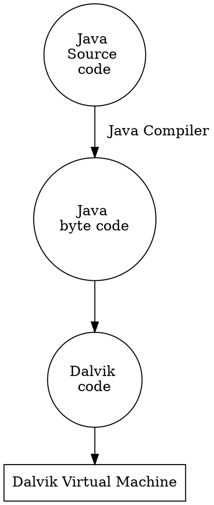
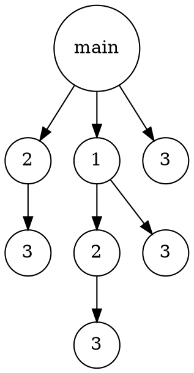
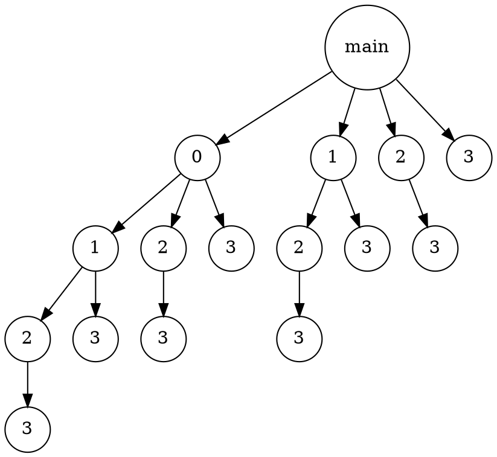

# **Chapter 1 Introduction**
> <font color="red">期中考看紅色</font>
#### <font color="red">1. What are the three main purposes of an operating system? </font>
1. 作為 user 與 hardware 之間的溝通橋樑，易於 user 操作
2. 作為系統資源的分配者，期望能有效運用資源
3. 監督user program的執行，防止其有意或無意的行為對系統造成重大危害
#### <font color="red">2. We have stressed the need for an operating system to make efficient use of the computing hardware. When is it appropriate for the operating system to forsake this principle and to “waste” resources? Why is such a system not really wasteful?</font>
OS 可幫助使用者有效分配資源、協調process、呈現GUI介面，提供使用者更多方便，其好處遠大於 OS 占用部分CPU資源

#### 3. What is the main difficulty that a programmer must overcome in writing an operating system for a real-time environment?
(For hard real-time system)
系統必須保證task在限定的時間內完成，不然將造成breakdown，使用者必須嚴格設計 scheduling algorithm

(For soft real-time system)
使用者不必嚴格設計 scheduling algorithm，但系統必須支援 preemptive 並且讓 real-time process 維持其 priority

#### 4. Keeping in mind the various definitions of operating system, consider whether the operating system should include applications such as web browsers and mail programs. Argue both that it should and that it should not, and support your answers.
 (支持的理由)
1. 減少 applications 與 OS 溝通的 latency，不會被 system 限制權限，applications 的效能會提升

 (不支持的理由)
1. OS(kernal) 必須持續執行，保證系統的安全性，及資源調度的有效性，applications 僅為特殊需求，不能算是 kernel 的一部份
2. 占用os記憶體空間，使得OS memory area過於龐大

#### <font color="red">5. How does the distinction between kernel mode and user mode function as a rudimentary form of protection (security)?</font>
只有 kernel mode 才能執行 preveliged instrctions，user mode 想要執行 preveliged instrctions 必須透過 syscall，委託 OS changemode

#### <font color="red">6. Which of the following instructions should be privileged?</font>
```
a. Set value of timer.
b. Read the clock.
c. Clear memory.
d. Issue a trap instruction.
e. Turn off interrupts.
f. Modify entries in device-status table.
g. Switch from user to kernel mode.
h. Access I/O device.
```

只要跟I/O有關 或 對系統有潛在危害的都是 privilieged instruction
Ans: acefgh 

#### 7. Some early computers protected the operating system by placing it in a memory partition that could not be modified by either the user job or the operating system itself. Describe two difficulties that you think could arise with such a scheme.
* OS 不易維護
* 需要被保護的 password 或 data 只能存入保護外的範圍，造成安全隱患

#### 8. Some CPUs provide for more than two modes of operation. What are two possible uses of these multiple modes?
* 提供 VM mode, 允許virtual machine 在系統中執行
* 提供 USB mode, 允許 USB 可直接進行存取，不須透過 OS

#### <font color="red">9. Timers could be used to compute the current time. Provide a short description of how this could be accomplished.</font>
* 限制 user program 的執行時間
* set timer to implement program Sleep function

#### 10. Give two reasons why caches are useful. What problems do they solve? What problems do they cause? If a cache can be made as large as the device for which it is caching (for instance, a cache as large as a disk), why not make it that large and eliminate the device?
有4個問題
* 作為 memory 與 CPU 之間的buffer、減輕慢速裝置的負擔
* 增進 data flow 的效能
* 維持資料的一致性
* cache size 夠用即可，無須花費更多成本購賣更龐大的 cache


#### 11. Distinguish between the client–server and peer-to-peer models of distributed systems.
client-server : clients 之間無法互相傳遞，只能與 server 存取
peer-to-peer : clients 之間可互相存取 


#### 12. How do clustered systems differ from multiprocessor systems? What is required for two machines belonging to a cluster to cooperate to provide a highly available service?
cluster 是計算機集群，它們有各自的 OS 和 clock；multiprocessor 為多核心系統，通常受同一個 OS 和 clock 管控

要求高度 throughput 的需求

#### ~~13. Consider a computing cluster consisting of two nodes running a database. Describe two ways in which the cluster software can manage access to the data on the disk. Discuss the benefits and disadvantages of each.~~

#### <font color="red">14. What is the purpose of interrupts? How does an interrupt differ from a trap? Can traps be generated intentionally by a user program? If so, for what purpose?</font>
* interrupt 通知 OS 有執行某些特殊event (I/O request、I/O complete)
* trap 是由 system 內部產生、interrupt 是由外部 I/O 產生
* error detector (divided by zero)

#### ~~15. Explain how the Linux kernel variables HZ and jiffies can be used to determine the number of seconds the system has been running since it was booted.~~


#### 16. Direct memory access is used for high-speed I/O devices in order to avoid increasing the CPU’s execution load. 
```
a. How does the CPU interface with the device to coordinate the
transfer?
b. How does the CPU know when the memory operations are complete?
c. The CPU is allowed to execute other programs while the DMA
controller is transferring data. Does this process interfere with
the execution of the user programs? If so, describe what forms of
interference are caused.
```

a. DMA controller
b. DMA controller generated interrupt to OS
c. CPU 和 DMA Controller 可能會共用 memory bus 或相同資源

#### 17. Some computer systems do not provide a privileged mode of operation in hardware. Is it possible to construct a secure operating system for these computer systems? Give arguments both that it is and that it is not possible.
(支持)
使用其他 software 監控 user program

(不支持)
缺乏 I/O protection, user mode 可隨意使用 preveliged instructions

#### 18. Many SMP systems have different levels of caches; one level is local to each processing core, and another level is shared among all processing cores. Why are caching systems designed this way?
local cache(L1,L2) : 每個 processor 皆有各自的 local cache 支持緩存機制，不須共用
shared cache(L3) : 支援 processor 之間資料相互傳遞的高速緩存機制，減少memory shared 的時間

#### <font color="red">19. Rank the following storage systems from slowest to fastest:</font>
```
a. Hard-disk drives
b. Registers
c. Optical disk
d. Main memory
e. Nonvolatile memory
f. Magnetic tapes
g. Cache
```
g > b > d > e > a > c > f
#### ~~20. Consider an SMP system similar to the one shown in Figure 1.8. Illustrate with an example how data residing in memory could in fact have a different value in each of the local caches.~~

#### 21. ~~Discuss, with examples, how the problem of maintaining coherence of cached data manifests itself in the following processing environments:~~
```
a. Single-processor systems
b. Multiprocessor systems
c. Distributed systems
```

#### 22. Describe a mechanism for enforcing memory protection in order to prevent a program from modifying the memory associated with other programs.
設定 base 和 limit, base 表示 program 在 memory 中的起始位置, limit 則表示 program 的容量, 以此限制每個 program 可存取的範圍
#### 23. Which network configuration—LAN or WAN—would best suit the following environments?
```
a. Acampus student union
b. Several campus locations across a statewide university system
c. Aneighborhood
```
Ans : LAN
#### 24. Describe some of the challenges of designing operating systems for mobile devices compared with designing operating systems for traditional PCs.
1. 記憶體空間更小
2. touch interface service

#### ~~25. What are some advantages of peer-to-peer systems over client–server systems?~~

#### ~~26. Describe some distributed applications that would be appropriate for a peer-to-peer system.~~

#### 27. Identify several advantages and several disadvantages of open-source operating systems. Identify the types of people who would find each aspect to be an advantage or a disadvantage.
優點:
可由社群的力量共同維護

缺點:
開源的系統較為零散，並沒有標準化環境及介面

---
# **Chapter 2 Operating-System Structures**

#### 1. <font color="red">What is the purpose of system calls?</font>
user program 可用 syscall 向 OS 請求更高權限的運行服務
#### 2. What is the purpose of the command interpreter? Why is it usually separate from the kernel?
讀取 user 提供的指令(直接在shell下指令 or open file etc.)，轉換成syscall

#### 3. What system calls have to be executed by a command interpreter or shell in order to start a new process on a UNIX system?
有兩個
fork(): clone parent process
exec(): overlays a new process

#### <font color="red">4. What is the purpose of system programs?</font>
協助 user 易於使用電腦，不須由 user 親自參與系統的管理

#### 5. What is the main advantage of the layered approach to system design? What are the disadvantages of the layered approach?
(優點)
easier to debug and modify

(缺點)
多層次架構會有額外的overhead

#### 6. List five services provided by an operating system, and explain how each creates convenience for users. In which cases would it be impossible for user-level programs to provide these services? Explain your answer.
* I/O operation : 協調各個device的存取，與device controller溝通
* process synchronization : 分配 CPU time 給各個 processes，根據 user 需求協調優先順序
* File management : 管理檔案在 disk 中的位址，以及刪除、新增、重新命名等功能
* error detector : 當 user program 發生 exception，OS 會執行相對應的處理
* accounting : 紀錄 system 內的所有 routine


#### 7. Why do some systems store the operating system in firmware, while others store it on disk?
嵌入式系統中，將 OS 放入 firmware 可增加開機速度，另外，firmware是唯讀記憶體，可避免OS area被讀寫

#### <font color="red">8. How could a system be designed to allow a choice of operating systems from which to boot?What would the bootstrap program need to do?</font>
(題目在問一台電腦有多種os可選擇，要怎麼選擇想要的os載入memory)

1. 設置 boot manager，提供 user 介面選擇想要載入的 OS 類型
2. 啟動 bootstrp program，從 disk 載入 OS 至 memory

(boot manager 和 bootstrap 不一樣)

#### <font color="red">9. The services and functions provided by an operating system can be divided into two main categories. Briefly describe the two categories, and discuss how they differ.</font>
* System service:主要處理process synchroniztion、interrupt service routine(ISR)、exception處理 etc.

* User service:主要提供 user 良好的使用環境，GUI介面、file management、I/O operation etc.

#### 10. Describe three general methods for passing parameters to the operating system.
* memory passing
* register passing
* stack passing

#### 11. Describe how you could obtain a statistical profile of the amount of time a program spends executing different sections of its code. Discuss the importance of obtaining such a statistical profile.

使用週期性的 timer interrupt  監控各 program section 所使用的CPU time

可針對消耗 CPU 資源較高的 program section 進行優化

#### 12. What are the advantages and disadvantages of using the same system call interface for manipulating both files and devices?
(優點)
每個 device 都可以像 file 一樣進行存取，這有利於user program 和 device driver 的開發，以類似方式存取device

(缺點)
將 device 視為 file 設計，可能出現安全漏洞，無發充分實施存取控制和保護

#### 13. Would it be possible for the user to develop a new command interpreter using the system-call interface provided by the operating system?
Yes

(功能的觀點)
command interperter 本來就是翻譯 user command，然後使用 syscall 呼叫 OS 

(權限的觀點)
呼叫 syscall 本來就是 user mode 可運行的指令

#### 14. Describe why Android uses ahead-of-time (AOT) rather than just-in-time(JIT) compilation.
AOT 可在 installation 過程進行 compile，以此提供更好的效能、降低overhead

**補充 : JIT is runtime compilation 

#### 15. What are the two models of interprocess communication? What are the strengths and weaknesses of the two approaches?
1. message passing :
(1) 優點 : 平台獨立
(2) 缺點 : overhead高、latency高

2. shared memory :
(1)優點 : overhead低、latency低
(2)缺點 : 資源分配問題
#### 16. Contrast and compare an application programming interface (API) and an application binary interface (ABI).
* API : 作為軟體與軟體間的交流介面
* ABI : 提供compiled application 與 operating system 間交流的規格
#### 17. <font color="red">Why is the separation of mechanism and policy desirable?</font>
* mechanism (how to do something) : 如何實作出此機制
* policy (what will be done) : 需要提供什麼機制

#### 18. It is sometimes difficult to achieve a layered approach if two components of the operating system are dependent on each other. Identify a scenario in which it is unclear how to layer two system components that require tight coupling of their functionalities. 
(舉例子 : 不知如何為兩個高度耦合的 layer 進行分層的情形)

以前的 memory 價格昂貴，虛擬記憶體(Virtual memory) 的發展正好彌補其缺陷，將資料 swap 到 disk 中，由此可見，虛擬記憶體與儲存系統是相互關聯的，另一方面，disk 需要明確劃分虛擬記憶體和 file，保證資料的完整性


#### 19. What is the main advantage of the microkernel approach to system design? How do user programs and system services interact in a microkernel architecture? What are the disadvantages of using the microkernel approach?
(優點)
* Modularity : kernel 保留部分 system service，其餘service成為user program，可在user mode運行
* Flexibility : 可以新增new service，而不會 kernel
* security : user program (包含 user service) 和 system service 有各自的 memory area，即使 user service 崩潰，也不至於影響 system


(缺點)
* user program 與 system service 位於不同 memory space，context switch 次數變頻繁

**補充: monolithic kernels 與 microkernel 相反，monolithic kernels 的概念在於將 OS 的大部分功能合併在一個軟體中

#### 20. What are the advantages of using loadable kernel modules?
* 根據user需求，擴充需要的service
* 比layered system更加彈性，modules之間可相互呼叫
* boot time 或 run time 載入module皆可 (就像USB)
#### 21. How are iOS and Android similar? How are they different?
(similar)
* 支援手機螢幕觸控
* 基本功能相似，message、定位、語音助理 etc.

(different)
* iOS系統封閉；andriod則有提供SDK，能夠自訂和開發。
* 應用程式從不同app store取得

#### 22. Explain why Java programs running on Android systems do not use the standard Java API and virtual machine.
java API 和 JVM 主要是為 PC 和 server 設計，不適用於行動裝置，因此 Google 為 Andriod 量身訂做另一款 JVM 稱為 Dalvik Virtual Machine，其設計針對低功號裝置進行最佳化，可增加效能、延長電池壽命

運作原理如下：


#### 23. The experimental Synthesis operating system has an assembler incorporated in the kernel. To optimize system-call performance, the kernel assembles routines within kernel space to minimize the path that the system call must take through the kernel. This approach is the antithesis(相反) of the layered approach, in which the path through the kernel is extended to make building the operating system easier. Discuss the pros and cons of the Synthesis approach to kernel design and system-performance optimization.
(Synthesis OS 降低 kernel 到 syscall 之間的距離，和 layered approach 擴充 kernel path 的方法相反)

(優點)
* kernel 到接收 syscall 的時間減短，有助於效能提升
* syscall 需要歷經的層數減少，overhead降低

(缺點)
* kernel 層數減少，降低 modify 和 debug 更難操作

---
# **Chapter 3 Processes**

#### <font color="red">1. Using the program shown in Figure 3.30, explain what the output will be at LINE A.</font>
```
#include <sys/types.h>
#include <stdio.h>
#include <unistd.h>
int value = 5;
int main()
{
pid t pid;
pid = fork();
if (pid == 0) { /* child process */
value += 15;
return 0;
}
else if (pid > 0) { /* parent process */
wait(NULL);
printf("PARENT: value = %d",value); /* LINE A */
return 0;
}
}
```
parent 和 child process 相互獨立
Ans : 5 
#### <font color="red">2. Including the initial parent process, how many processes are created by the program shown in Figure 3.31?</font>
```
#include <stdio.h>
#include <unistd.h>
int main()
{
/* fork a child process */
fork();
/* fork another child process */
fork();
/* and fork another */
fork();
return 0;
}
```

Ans : 8 processes

#### 3. Original versions of Apple’s mobile iOS operating system provided no means of concurrent processing. Discuss three major complications that concurrent processing adds to an operating system.
* 設計嚴格的scheduling algorithm
* 設計 deadlock 和 race condition 機制，協調共享資源存取
* 考量需要多次context switch，避免 OS 超載


#### 4. Some computer systems provide multiple register sets. Describe what happens when a context switch occurs if the new context is already loaded into one of the register sets. What happens if the new context is in memory rather than in a register set and all the register sets are in use?
register sets 可用於存取 new process 的狀態，當 process 取得 CPU 使用權時，可直接從 register sets 調用，以減短通訊時間，此方法常用於增進 context switch 的效能

#### 5. When a process creates a newprocess using the fork() operation, which of the following states is shared between the parent process and the child process?
```
a. Stack
b. Heap
c. Shared memory segments
```
stack 和 heap 的資料需要傳輸，得先存入 Shared memory segments
Ans : c

#### 6. Consider the “exactly once”semantic with respect to the RPC mechanism. Does the algorithm for implementing this semantic execute correctly even if the ACK message sent back to the client is lost due to a network problem? Describe the sequence of messages, and discuss whether “exactly once” is still preserved.
(資網的範圍)
若 message 回應超時，則再次發送請求；為考量 message 可能有 delayed 和 lost 兩種情形，"exactly once" 可保證資料的一致性，面對多次請求仍保持一致性

implement 要求:
idempotence (冪等) : 重複的 resquest 不會導致錯誤，仍保持資料一致性
identification (辨識) : 每個 message 都有各自的 id 進行辨識

#### 7. ~~Assume that a distributed system is susceptible to server failure. What mechanisms would be required to guarantee the “exactly once” semantic for execution of RPCs?~~


#### <font color="red">8. Describe the actions taken by a kernel to context-switch between processes.</font>
1. 因某些原因 old process 必須 waiting (e.g. waiting for I/O complete)
2. 儲存 old process 的 PCB 資訊到 register 或 memory
3. OS 載入 new process
4. 等到 old process waiting 結束，發送 interrupt 給 OS，將 CPU 使用權歸還並將其 PCB 資訊載回


#### ~~9. Construct a process tree similar to Figure 3.7. To obtain process informationfor the UNIX or Linux system, use the command ps -ael. Use the command man ps to get more information about the ps command. The task manager on Windows systems does not provide the parent process ID, but the process monitor tool, available from technet. microsoft.com, provides a process-tree tool.~~


#### 10. Explain the role of the init (or systemd) process on UNIX and Linux systems in regard to process termination.
init (systemd) 負責 shutdown 或 reboot 正在執行的 processes 進入終止程序，可發送正常終止訊號(SIGTERM)或強制終止訊號(SIGKILL)，以此維護系統完整性

#### <font color="red">11. Including the initial parent process, how many processes are created by the program shown in Figure 3.32?</font>
```
#include <stdio.h>
#include <unistd.h>
int main()
{
int i;
for (i = 0; i < 4; i++)
fork();
return 0;
}
```



Ans : 16

#### <font color="red">12. Explain the circumstances under which the line of code marked printf("LINE J") in Figure 3.33 will be reached.</font>
```
#include <sys/types.h>
#include <stdio.h>
#include <unistd.h>
int main()
{
pid_t pid;
/* fork a child process */
pid = fork();
if (pid < 0) { /* error occurred */
fprintf(stderr, "Fork Failed");
return 1;
}
else if (pid == 0) { /* child process */
execlp("/bin/ls","ls",NULL);
printf("LINE J");
}
else { /* parent process */
/* parent will wait for the child to complete */
wait(NULL);
printf("Child Complete");
}
return 0;
}
```
如果 fork() 正常執行，child process 的 pid 會被設為 0；反之，pid < 0，無法正常執行 child process

如果 execlp 正常執行，系統會調用 new process 覆蓋當前的 process，printf("LINE J")將無法執行

Ans : 
To receive the executing result of printf("LINE J"), there are two main circumstances:
1. fork() correctly executed and set the value pid == 0 without error.
2. execlp calls to fail.

#### 13. Using the program in Figure 3.34, identify the values of pid at lines A, B, C, and D. (Assume that the actual pids of the parent and child are 2600 and 2603, respectively.)
```
#include <sys/types.h>
#include <stdio.h>
#include <unistd.h>
int main()
{
pid_t pid, pid1;
/* fork a child process */
pid = fork();
if (pid < 0) { /* error occurred */
fprintf(stderr, "Fork Failed");
return 1;
}
else if (pid == 0) { /* child process */
pid1 = getpid();
printf("child: pid = %d",pid); /* A */
printf("child: pid1 = %d",pid1); /* B */
}
else { /* parent process */
pid1 = getpid();
printf("parent: pid = %d",pid); /* C */
printf("parent: pid1 = %d",pid1); /* D */
wait(NULL);
}
return 0;
}
```
Ans : A=0, B=2603, C=2603, D=2600

#### 14. Give an example of a situation in which ordinary pipes are more suitable than named pipes and an example of a situation in which named pipes are more suitable than ordinary pipes.


#### 15. Consider the RPC mechanism. Describe the undesirable consequences that could arise from not enforcing either the “at most once” or “exactly once” semantic. Describe possible uses for a mechanism that has neither of these guarantees.


#### 16. Using the program shown in Figure 3.35, explain what the output will be at lines X and Y.
```
#include <sys/types.h>
#include <stdio.h>
#include <unistd.h>
#define SIZE 5
int nums[SIZE] = {0,1,2,3,4};
int main()
{
int i;
pid t pid;
pid = fork();
if (pid == 0) {
for (i = 0; i < SIZE; i++) {
nums[i] *= -i;
printf("CHILD: %d ",nums[i]); /* LINE X */
}
}
else if (pid > 0) {
wait(NULL);
for (i = 0; i < SIZE; i++)
printf("PARENT: %d ",nums[i]); /* LINE Y */
}
return
```


#### 17. What are the benefits and the disadvantages of each of the following? Consider both the system level and the programmer level.
```
a. Synchronous and asynchronous communication
b. Automatic and explicit buffering
c. Send by copy and send by reference
d. Fixed-sized and variable-sized messages
```

---
# **Chapter 4 Threads & Concurrency**

#### 1. Provide three programming examples in which multithreading provides better performance than a single-threaded solution.

#### 2. Using Amdahl’s Law, calculate the speedup gain of an application that has a 60 percent parallel component for (a) two processing cores and (b) four processing cores.

#### 3. Does the multithreaded web server described in Section 4.1 exhibit task or data parallelism?

#### 4. What are two differences between user-level threads and kernel-level threads? Under what circumstances is one type better than the other?

#### 5. Describe the actions taken by a kernel to context-switch between kernellevel threads.

#### 6. What resources are used when a thread is created? How do they differ from those used when a process is created?

#### 7. Assume that an operating system maps user-level threads to the kernel using the many-to-many model and that the mapping is done through LWPs. Furthermore, the system allows developers to create real-time threads for use in real-time systems. Is it necessary to bind a real-time thread to an LWP? Explain.

#### 8. Provide two programming examples in which multithreading does not provide better performance than a single-threaded solution.

#### 9. Under what circumstances does a multithreaded solution using multiple kernel threads provide better performance than a single-threaded solution on a single-processor system?

#### 10. Which of the following components of program state are shared across threads in a multithreaded process?
```
a. Register values
b. Heap memory
c. Global variables
d. Stack memory
```

#### 11. Can a multithreaded solution using multiple user-level threads achieve better performance on a multiprocessor system than on a single-processor system? Explain.

#### 12. In Chapter 3, we discussed Google’s Chrome browser and its practice of opening each new tab in a separate process.Would the same benefits have been achieved if, instead, Chrome had been designed to open each new tab in a separate thread? Explain.

#### 13. Is it possible to have concurrency but not parallelism? Explain.

#### 14. UsingAmdahl’s Law, calculate the speedup gain for the following applications:
```
• 40 percent parallel with (a) eight processing cores and (b) sixteen processing cores
• 67 percent parallel with (a) two processing cores and (b) four processing cores
• 90 percent parallel with (a) four processing cores and (b) eight processing cores
```


#### 15. Determine if the following problems exhibit task or data parallelism:
```
• Using a separate thread to generate a thumbnail for each photo in a
collection
• Transposing a matrix in parallel
• Anetworked application where one thread reads from the network
and another writes to the network
• The fork-join array summation application described in Section 4.5.2
• The Grand Central Dispatch system
```


#### 16. A system with two dual-core processors has four processors available for scheduling. A CPU-intensive application is running on this system. All input is performed at program start-up, when a single file must beopened. Similarly, all output is performed just before the program terminates, when the program results must bewritten to a single file. Between start-up and termination, the program is entirely CPU-bound. Your task is to improve the performance of this application by multithreading it. The application runs on a system that uses the one-to-one threading model (each user thread maps to a kernel thread).
```
• How many threads will you create to perform the input and output?
Explain.
• How many threads will you create for the CPU-intensive portion of
the application? Explain.
```

#### 17. Consider the following code segment:
```
pid t pid;
pid = fork();
if (pid == 0) { /* child process */
fork();
thread create( . . .);
}
fork();

a. How many unique processes are created?
b. How many unique threads are created?
```

#### 18 As described in Section 4.7.2, Linux does not distinguish between processes and threads. Instead, Linux treats both in the same way, allowing a task to be more akin to a process or a thread depending on the set of flags passed to the clone() system call. However, other operating systems, such asWindows, treat processes and threads differently. Typically, such systems use a notation in which the data structure for a process contains pointers to the separate threads belonging to the process. Contrast these two approaches for modeling processes and threads within the kernel.

#### 19. The program shown in Figure 4.23 uses the Pthreads API. What would be the output from the program at LINE C and LINE P?
```
#include <pthread.h>
#include <stdio.h>
int value = 0;
void *runner(void *param); /* the thread */
int main(int argc, char *argv[])
{
pid t pid;
pthread t tid;
pthread attr t attr;
pid = fork();
if (pid == 0) { /* child process */
pthread attr init(&attr);
pthread create(&tid,&attr,runner,NULL);
pthread join(tid,NULL);
printf("CHILD: value = %d",value); /* LINE C */
}
else if (pid > 0) { /* parent process */
wait(NULL);
printf("PARENT: value = %d",value); /* LINE P */
}
}
void *runner(void *param) {
value = 5;
pthread exit(0);
}
```

#### 20. Consider a multicore system and a multithreaded program written using the many-to-many threading model. Let the number of user-level threads in the program be greater than the number of processing cores in the system. Discuss the performance implications of the following scenarios.
```
a. The number of kernel threads allocated to the program is less than
the number of processing cores.
b. The number of kernel threads allocated to the program is equal to
the number of processing cores.
c. The number of kernel threads allocated to the program is greater
than the number of processing cores but less than the number of
user-level threads.
```

#### 21. Pthreads provides an API for managing thread cancellation. The pthread setcancelstate() function is used to set the cancellation state. Its prototype appears as follows: <br><br>&ensp;&ensp;&ensp;&ensp;&ensp;<i>pthread setcancelstate(int state, int *oldstate)</i><br><br>The two possible values for the state are PTHREAD CANCEL ENABLE and PTHREAD CANCEL DISABLE. Using the code segment shown in Figure 4.24, provide examples of two operations that would be suitable to perform between the calls to disable and enable thread cancellation.
```
int oldstate;
pthread setcancelstate(PTHREAD CANCEL DISABLE, &oldstate);
/* What operations would be performed here? */
pthread setcancelstate(PTHREAD CANCEL ENABLE, &oldstate);
```

---
# **Chapter 5 CPU Scheduling**

---
# **Chapter 6 Synchronization Tools**

---
# **Chapter 7 Synchronization Examples**

---
# **Chapter 8 Deadlocks**

---
# **Chapter 9 Main Memory**

---
# **Chapter 10 Virtual Memory**

---
# **Chapter 11 Mass-Storage Structure**

---
# **Chapter 12 I/O Systems**

---
# **Chapter 13 File-System Interface**
