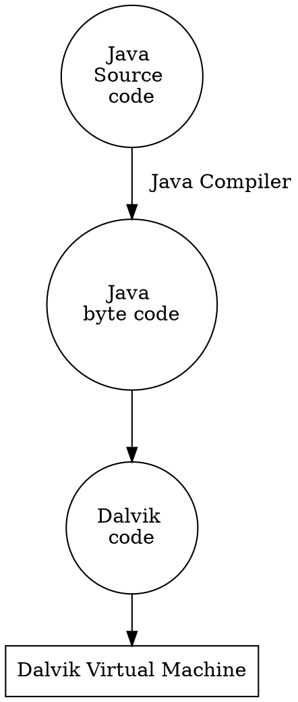
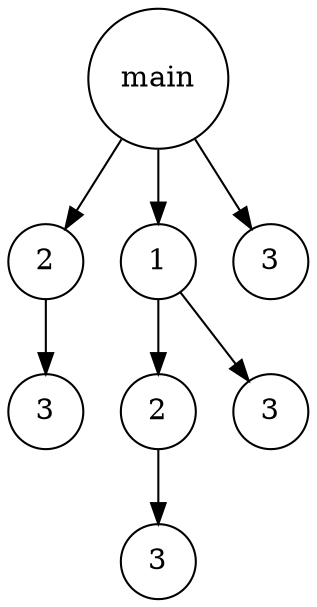
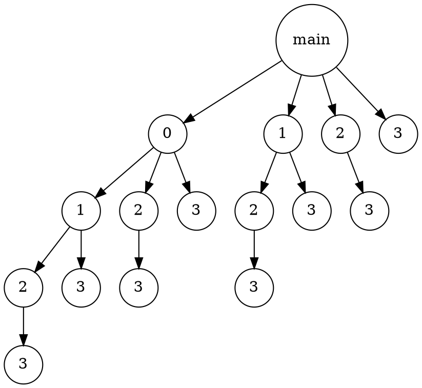
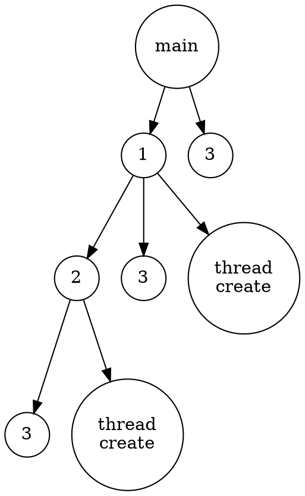

# **Chapter 1 Introduction**
> <font color="red">期中考看紅色</font>
#### <font color="red">1. What are the three main purposes of an operating system? </font>
1. 作為 user 與 hardware 之間的溝通橋樑，易於 user 操作
2. 作為系統資源的分配者，期望能有效運用資源
3. 監督user program的執行，防止其有意或無意的行為對系統造成重大危害
#### <font color="red">2. We have stressed the need for an operating system to make efficient use of the computing hardware. When is it appropriate for the operating system to forsake this principle and to “waste” resources? Why is such a system not really wasteful?</font>
OS 可幫助使用者有效分配資源、協調process、呈現GUI介面，提供使用者更多方便，其好處遠大於 OS 占用部分CPU資源

#### 3. What is the main difficulty that a programmer must overcome in writing an operating system for a real-time environment?
(For hard real-time system)
系統必須保證task在限定的時間內完成，不然將造成breakdown，使用者必須嚴格設計 scheduling algorithm

(For soft real-time system)
使用者不必嚴格設計 scheduling algorithm，但系統必須支援 preemptive 並且讓 real-time process 維持其 priority

#### 4. Keeping in mind the various definitions of operating system, consider whether the operating system should include applications such as web browsers and mail programs. Argue both that it should and that it should not, and support your answers.
 (支持的理由)
* 減少 applications 與 OS 溝通的 latency，不會被 system 限制權限，applications 的效能會提升

 (不支持的理由)
* OS(kernal) 必須持續執行，保證系統的安全性，及資源調度的有效性，applications 僅為特殊需求，不能算是 kernel 的一部份
* 占用os記憶體空間，使得OS memory area過於龐大

#### <font color="red">5. How does the distinction between kernel mode and user mode function as a rudimentary form of protection (security)?</font>
只有 kernel mode 才能執行 preveliged instrctions，user mode 想要執行 preveliged instrctions 必須透過 syscall，委託 OS changemode

#### <font color="red">6. Which of the following instructions should be privileged?</font>
```
a. Set value of timer.
b. Read the clock.
c. Clear memory.
d. Issue a trap instruction.
e. Turn off interrupts.
f. Modify entries in device-status table.
g. Switch from user to kernel mode.
h. Access I/O device.
```

只要跟I/O有關 或 對系統有潛在危害的都是 privilieged instruction
<br>Ans: acefgh 

#### 7. Some early computers protected the operating system by placing it in a memory partition that could not be modified by either the user job or the operating system itself. Describe two difficulties that you think could arise with such a scheme.
* OS 不易維護
* 需要被保護的 password 或 data 只能存入保護外的範圍，造成安全隱患

#### 8. Some CPUs provide for more than two modes of operation. What are two possible uses of these multiple modes?
* 提供 VM mode, 允許virtual machine 在系統中執行
* 提供 USB mode, 允許 USB 可直接進行存取，不須透過 OS

#### <font color="red">9. Timers could be used to compute the current time. Provide a short description of how this could be accomplished.</font>
* 限制 user program 的執行時間
* set timer to implement program Sleep function

#### 10. Give two reasons why caches are useful. What problems do they solve? What problems do they cause? If a cache can be made as large as the device for which it is caching (for instance, a cache as large as a disk), why not make it that large and eliminate the device?
(有4個問題)
* 作為 memory 與 CPU 之間的buffer、減輕慢速裝置的負擔
* 增進 data flow 的效能
* 維持資料的一致性
* cache size 夠用即可，無須花費更多成本購賣更龐大的 cache


#### 11. Distinguish between the client–server and peer-to-peer models of distributed systems.
client-server : clients 之間無法互相傳遞，只能與 server 存取
<br>peer-to-peer : clients 之間可互相存取 


#### 12. How do clustered systems differ from multiprocessor systems? What is required for two machines belonging to a cluster to cooperate to provide a highly available service?
cluster 是計算機集群，它們有各自的 OS 和 clock；multiprocessor 為多核心系統，通常受同一個 OS 和 clock 管控

要求高度 throughput 的需求

#### ~~13. Consider a computing cluster consisting of two nodes running a database. Describe two ways in which the cluster software can manage access to the data on the disk. Discuss the benefits and disadvantages of each.~~

#### <font color="red">14. What is the purpose of interrupts? How does an interrupt differ from a trap? Can traps be generated intentionally by a user program? If so, for what purpose?</font>
* interrupt 通知 OS 有執行某些特殊event (I/O request、I/O complete)
* trap 是由 system 內部產生、interrupt 是由外部 I/O 產生
* error detector (divided by zero)

#### ~~15. Explain how the Linux kernel variables HZ and jiffies can be used to determine the number of seconds the system has been running since it was booted.~~


#### 16. Direct memory access is used for high-speed I/O devices in order to avoid increasing the CPU’s execution load. 
```
a. How does the CPU interface with the device to coordinate the
transfer?
b. How does the CPU know when the memory operations are complete?
c. The CPU is allowed to execute other programs while the DMA
controller is transferring data. Does this process interfere with
the execution of the user programs? If so, describe what forms of
interference are caused.
```

a. DMA controller
<br>b. DMA controller generated interrupt to OS
<br>c. CPU 和 DMA Controller 可能會共用 memory bus 或相同資源

#### 17. Some computer systems do not provide a privileged mode of operation in hardware. Is it possible to construct a secure operating system for these computer systems? Give arguments both that it is and that it is not possible.
(支持)
<br>使用其他 software 監控 user program

(不支持)
<br>缺乏 I/O protection, user mode 可隨意使用 preveliged instructions

#### 18. Many SMP systems have different levels of caches; one level is local to each processing core, and another level is shared among all processing cores. Why are caching systems designed this way?
local cache(L1,L2) : 每個 processor 皆有各自的 local cache 支持緩存機制，不須共用
shared cache(L3) : 支援 processor 之間資料相互傳遞的高速緩存機制，減少memory shared 的時間

#### <font color="red">19. Rank the following storage systems from slowest to fastest:</font>
```
a. Hard-disk drives
b. Registers
c. Optical disk
d. Main memory
e. Nonvolatile memory
f. Magnetic tapes
g. Cache
```
g > b > d > e > a > c > f
#### ~~20. Consider an SMP system similar to the one shown in Figure 1.8. Illustrate with an example how data residing in memory could in fact have a different value in each of the local caches.~~

#### 21. ~~Discuss, with examples, how the problem of maintaining coherence of cached data manifests itself in the following processing environments:~~
```
a. Single-processor systems
b. Multiprocessor systems
c. Distributed systems
```

#### 22. Describe a mechanism for enforcing memory protection in order to prevent a program from modifying the memory associated with other programs.
設定 base 和 limit, base 表示 program 在 memory 中的起始位置, limit 則表示 program 的容量, 以此限制每個 program 可存取的範圍
#### 23. Which network configuration—LAN or WAN—would best suit the following environments?
```
a. Acampus student union
b. Several campus locations across a statewide university system
c. Aneighborhood
```
Ans : LAN
#### 24. Describe some of the challenges of designing operating systems for mobile devices compared with designing operating systems for traditional PCs.
1. 記憶體空間更小
2. touch interface service

#### ~~25. What are some advantages of peer-to-peer systems over client–server systems?~~

#### ~~26. Describe some distributed applications that would be appropriate for a peer-to-peer system.~~

#### 27. Identify several advantages and several disadvantages of open-source operating systems. Identify the types of people who would find each aspect to be an advantage or a disadvantage.
優點:
可由社群的力量共同維護

缺點:
開源的系統較為零散，並沒有標準化環境及介面

---
# **Chapter 2 Operating-System Structures**

#### 1. <font color="red">What is the purpose of system calls?</font>
user program 可用 syscall 向 OS 請求更高權限的運行服務
#### 2. What is the purpose of the command interpreter? Why is it usually separate from the kernel?
讀取 user 提供的指令(直接在shell下指令 or open file etc.)，轉換成syscall

#### 3. What system calls have to be executed by a command interpreter or shell in order to start a new process on a UNIX system?
有兩個
fork(): clone parent process
exec(): overlays a new process

#### <font color="red">4. What is the purpose of system programs?</font>
協助 user 易於使用電腦，不須由 user 親自參與系統的管理

#### 5. What is the main advantage of the layered approach to system design? What are the disadvantages of the layered approach?
(優點)
easier to debug and modify

(缺點)
多層次架構會有額外的overhead

#### 6. List five services provided by an operating system, and explain how each creates convenience for users. In which cases would it be impossible for user-level programs to provide these services? Explain your answer.
* I/O operation : 協調各個device的存取，與device controller溝通
* process synchronization : 分配 CPU time 給各個 processes，根據 user 需求協調優先順序
* File management : 管理檔案在 disk 中的位址，以及刪除、新增、重新命名等功能
* error detector : 當 user program 發生 exception，OS 會執行相對應的處理
* accounting : 紀錄 system 內的所有 routine


#### 7. Why do some systems store the operating system in firmware, while others store it on disk?
嵌入式系統中，將 OS 放入 firmware 可增加開機速度，另外，firmware是唯讀記憶體，可避免OS area被讀寫

#### <font color="red">8. How could a system be designed to allow a choice of operating systems from which to boot?What would the bootstrap program need to do?</font>
(題目在問一台電腦有多種os可選擇，要怎麼選擇想要的os載入memory)

1. 設置 boot manager，提供 user 介面選擇想要載入的 OS 類型
2. 啟動 bootstrp program，從 disk 載入 OS 至 memory

(boot manager 和 bootstrap 不一樣)

#### <font color="red">9. The services and functions provided by an operating system can be divided into two main categories. Briefly describe the two categories, and discuss how they differ.</font>
* System service:主要處理process synchroniztion、interrupt service routine(ISR)、exception處理 etc.

* User service:主要提供 user 良好的使用環境，GUI介面、file management、I/O operation etc.

#### 10. Describe three general methods for passing parameters to the operating system.
* memory passing
* register passing
* stack passing

#### 11. Describe how you could obtain a statistical profile of the amount of time a program spends executing different sections of its code. Discuss the importance of obtaining such a statistical profile.

使用週期性的 timer interrupt  監控各 program section 所使用的CPU time

可針對消耗 CPU 資源較高的 program section 進行優化

#### 12. What are the advantages and disadvantages of using the same system call interface for manipulating both files and devices?
(優點)
<br>每個 device 都可以像 file 一樣進行存取，這有利於user program 和 device driver 的開發，以類似方式存取device

(缺點)
<br>將 device 視為 file 設計，可能出現安全漏洞，無發充分實施存取控制和保護

#### 13. Would it be possible for the user to develop a new command interpreter using the system-call interface provided by the operating system?
Yes

(功能的觀點)
<br>command interperter 本來就是翻譯 user command，然後使用 syscall 呼叫 OS 

(權限的觀點)
<br>呼叫 syscall 本來就是 user mode 可運行的指令

#### 14. Describe why Android uses ahead-of-time (AOT) rather than just-in-time(JIT) compilation.
AOT 可在 installation 過程進行 compile，以此提供更好的效能、降低overhead

**補充 : JIT is runtime compilation 

#### 15. What are the two models of interprocess communication? What are the strengths and weaknesses of the two approaches?
1. message passing :
<br>(1) 優點 : 平台獨立
<br>(2) 缺點 : overhead高、latency高

2. shared memory :
<br>(1)優點 : overhead低、latency低
<br>(2)缺點 : 資源分配問題
#### 16. Contrast and compare an application programming interface (API) and an application binary interface (ABI).
* API : 作為軟體與軟體間的交流介面
* ABI : 提供compiled application 與 operating system 間交流的規格
#### <font color="red">17. Why is the separation of mechanism and policy desirable?</font>
* mechanism (how to do something) : 如何實作出此機制
* policy (what will be done) : 需要提供什麼機制

#### 18. It is sometimes difficult to achieve a layered approach if two components of the operating system are dependent on each other. Identify a scenario in which it is unclear how to layer two system components that require tight coupling of their functionalities. 
(舉例子 : 不知如何為兩個高度耦合的 layer 進行分層的情形)

以前的 memory 價格昂貴，虛擬記憶體(Virtual memory) 的發展正好彌補其缺陷，將資料 swap 到 disk 中，由此可見，虛擬記憶體與儲存系統是相互關聯的，另一方面，disk 需要明確劃分虛擬記憶體和 file，保證資料的完整性


#### 19. What is the main advantage of the microkernel approach to system design? How do user programs and system services interact in a microkernel architecture? What are the disadvantages of using the microkernel approach?
(優點)
* Modularity : kernel 保留部分 system service，其餘service成為user program，可在user mode運行
* Flexibility : 可以新增new service，而不會 kernel
* security : user program (包含 user service) 和 system service 有各自的 memory area，即使 user service 崩潰，也不至於影響 system


(缺點)
* user program 與 system service 位於不同 memory space，context switch 次數變頻繁

**補充: monolithic kernels 與 microkernel 相反，monolithic kernels 的概念在於將 OS 的大部分功能合併在一個軟體中

#### 20. What are the advantages of using loadable kernel modules?
* 根據user需求，擴充需要的service
* 比layered system更加彈性，modules之間可相互呼叫
* boot time 或 run time 載入module皆可 (就像USB)
#### 21. How are iOS and Android similar? How are they different?
(similar)
* 支援手機螢幕觸控
* 基本功能相似，message、定位、語音助理 etc.

(different)
* iOS系統封閉；andriod則有提供SDK，能夠自訂和開發。
* 應用程式從不同app store取得

#### 22. Explain why Java programs running on Android systems do not use the standard Java API and virtual machine.
java API 和 JVM 主要是為 PC 和 server 設計，不適用於行動裝置，因此 Google 為 Andriod 量身訂做另一款 JVM 稱為 Dalvik Virtual Machine，其設計針對低功號裝置進行最佳化，可增加效能、延長電池壽命

運作原理如下：


#### 23. The experimental Synthesis operating system has an assembler incorporated in the kernel. To optimize system-call performance, the kernel assembles routines within kernel space to minimize the path that the system call must take through the kernel. This approach is the antithesis(相反) of the layered approach, in which the path through the kernel is extended to make building the operating system easier. Discuss the pros and cons of the Synthesis approach to kernel design and system-performance optimization.
(Synthesis OS 降低 kernel 到 syscall 之間的距離，和 layered approach 擴充 kernel path 的方法相反)

(優點)
* kernel 到接收 syscall 的時間減短，有助於效能提升
* syscall 需要歷經的層數減少，overhead降低

(缺點)
* kernel 層數減少，降低 modify 和 debug 更難操作

---
# **Chapter 3 Processes**

#### <font color="red">1. Using the program shown in Figure 3.30, explain what the output will be at LINE A.</font>
```
#include <sys/types.h>
#include <stdio.h>
#include <unistd.h>
int value = 5;
int main()
{
pid t pid;
pid = fork();
if (pid == 0) { /* child process */
value += 15;
return 0;
}
else if (pid > 0) { /* parent process */
wait(NULL);
printf("PARENT: value = %d",value); /* LINE A */
return 0;
}
}
```
parent 和 child process 相互獨立
<br>Ans : 5 
#### <font color="red">2. Including the initial parent process, how many processes are created by the program shown in Figure 3.31?</font>
```
#include <stdio.h>
#include <unistd.h>
int main()
{
/* fork a child process */
fork();
/* fork another child process */
fork();
/* and fork another */
fork();
return 0;
}
```

Ans : 8 processes

#### 3. Original versions of Apple’s mobile iOS operating system provided no means of concurrent processing. Discuss three major complications that concurrent processing adds to an operating system.
* 設計嚴格的scheduling algorithm
* 設計 deadlock 和 race condition 機制，協調共享資源存取
* 考量需要多次context switch，避免 OS 超載


#### 4. Some computer systems provide multiple register sets. Describe what happens when a context switch occurs if the new context is already loaded into one of the register sets. What happens if the new context is in memory rather than in a register set and all the register sets are in use?
register sets 可用於存取 new process 的狀態，當 process 取得 CPU 使用權時，可直接從 register sets 調用，以減短通訊時間，此方法常用於增進 context switch 的效能

#### 5. When a process creates a newprocess using the fork() operation, which of the following states is shared between the parent process and the child process?
```
a. Stack
b. Heap
c. Shared memory segments
```
stack 和 heap 的資料得先存入 Shared memory segments，才能傳資料
<br>Ans : c

#### 6. Consider the “exactly once”semantic with respect to the RPC mechanism. Does the algorithm for implementing this semantic execute correctly even if the ACK message sent back to the client is lost due to a network problem? Describe the sequence of messages, and discuss whether “exactly once” is still preserved.
(資網的範圍)<br>
若 message 回應超時，則再次發送請求；為考量 message 可能有 delayed 和 lost 兩種情形，"exactly once" 可保證資料的一致性，面對多次請求仍保持一致性

implement 要求:
<br>idempotence (冪等) : 重複的 resquest 不會導致錯誤，仍保持資料一致性
<br>identification (辨識) : 每個 message 都有各自的 id 進行辨識

#### 7. ~~Assume that a distributed system is susceptible to server failure. What mechanisms would be required to guarantee the “exactly once” semantic for execution of RPCs?~~


#### <font color="red">8. Describe the actions taken by a kernel to context-switch between processes.</font>
1. 因某些原因 old process 必須 waiting (e.g. waiting for I/O complete)
2. 儲存 old process 的 PCB 資訊到 register 或 memory
3. OS 載入 new process
4. 等到 old process waiting 結束，發送 interrupt 給 OS，將 CPU 使用權歸還並將其 PCB 資訊載回


#### ~~9. Construct a process tree similar to Figure 3.7. To obtain process informationfor the UNIX or Linux system, use the command ps -ael. Use the command man ps to get more information about the ps command. The task manager on Windows systems does not provide the parent process ID, but the process monitor tool, available from technet. microsoft.com, provides a process-tree tool.~~


#### 10. Explain the role of the init (or systemd) process on UNIX and Linux systems in regard to process termination.
init (systemd) 負責 shutdown 或 reboot 正在執行的 processes 進入終止程序，可發送正常終止訊號 (SIGTERM) 或強制終止訊號 (SIGKILL)，以此維護系統完整性

#### <font color="red">11. Including the initial parent process, how many processes are created by the program shown in Figure 3.32?</font>
```
#include <stdio.h>
#include <unistd.h>
int main()
{
int i;
for (i = 0; i < 4; i++)
fork();
return 0;
}
```



Ans : 16

#### 12. Explain the circumstances under which the line of code marked printf("LINE J") in Figure 3.33 will be reached.
```
#include <sys/types.h>
#include <stdio.h>
#include <unistd.h>
int main()
{
pid_t pid;
/* fork a child process */
pid = fork();
if (pid < 0) { /* error occurred */
fprintf(stderr, "Fork Failed");
return 1;
}
else if (pid == 0) { /* child process */
execlp("/bin/ls","ls",NULL);
printf("LINE J");
}
else { /* parent process */
/* parent will wait for the child to complete */
wait(NULL);
printf("Child Complete");
}
return 0;
}
```
如果 fork() 正常執行，child process 的 pid 會被設為 0；反之，pid < 0，無法正常執行 child process

如果 execlp 正常執行，系統會調用 new process 覆蓋當前的 process，printf("LINE J")將無法執行

Ans : 
To receive the executing result of printf("LINE J"), there are two main circumstances:
1. fork() correctly executed and set the value pid == 0 without error.
2. execlp calls to fail.

#### <font color="red">13. Using the program in Figure 3.34, identify the values of pid at lines A, B, C, and D. (Assume that the actual pids of the parent and child are 2600 and 2603, respectively.)</font>
```
#include <sys/types.h>
#include <stdio.h>
#include <unistd.h>
int main()
{
pid_t pid, pid1;
/* fork a child process */
pid = fork();
if (pid < 0) { /* error occurred */
fprintf(stderr, "Fork Failed");
return 1;
}
else if (pid == 0) { /* child process */
pid1 = getpid();
printf("child: pid = %d",pid); /* A */
printf("child: pid1 = %d",pid1); /* B */
}
else { /* parent process */
pid1 = getpid();
printf("parent: pid = %d",pid); /* C */
printf("parent: pid1 = %d",pid1); /* D */
wait(NULL);
}
return 0;
}
```
Ans : A=0, B=2603, C=2603, D=2600

#### 14. Give an example of a situation in which ordinary pipes are more suitable than named pipes and an example of a situation in which named pipes are more suitable than ordinary pipes.
(ordinary pipes prefer) **補充 : 半雙工, 只能允許兩個有關連的 process 存取
* parent process 與 child process 之間的傳遞

(named pipes prefer) **補充 : 全雙工, 多個 process 可共用相同 pipe
*  messaging app 中許多 user 同時傳送 message

#### 15. ~~Consider the RPC mechanism. Describe the undesirable consequences that could arise from not enforcing either the “at most once” or “exactly once” semantic. Describe possible uses for a mechanism that has neither of these guarantees.~~


#### <font color="red">16. Using the program shown in Figure 3.35, explain what the output will be at lines X and Y.</font>
```
#include <sys/types.h>
#include <stdio.h>
#include <unistd.h>
#define SIZE 5
int nums[SIZE] = {0,1,2,3,4};
int main()
{
int i;
pid t pid;
pid = fork();
if (pid == 0) {
for (i = 0; i < SIZE; i++) {
nums[i] *= -i;
printf("CHILD: %d ",nums[i]); /* LINE X */
}
}
else if (pid > 0) {
wait(NULL);
for (i = 0; i < SIZE; i++)
printf("PARENT: %d ",nums[i]); /* LINE Y */
}
return
```

LINE X : 0, -1, -4, -9, -16 
<br>LINE Y : 0, 1, 2, 3, 4

#### 17. What are the benefits and the disadvantages of each of the following? Consider both the system level and the programmer level.
```
a. Synchronous and asynchronous communication
b. Automatic and explicit buffering
c. Send by copy and send by reference
d. Fixed-sized and variable-sized messages
```
a. 
* Synchronous allows endezvous between sender and receiver, while asynchronous does not allow this machanism
* asynchronous

b. 
*  Automatic buffering : message queue 的空間無限大，sender 可將 message 先放入佇列，不必進入 block
*  explicit buffering : message queue 的空間固定，當 sender 數量較多或傳送資料較大時，需要進入 block 機制，等待 queue 中的記憶體釋放

c. 
* send by copy : 原始資料不會被串改，適用於少量的資料傳輸。
* send by reference : 由於 recevier 接收的資料與原始資料位於相同 memory address，receiver 所做的動作可能改變原始資料，適用於傳送大量資料。

d. 
* Fixed-sized : buffer area 可以事先得知資料大小，有利於記憶體分配，適用於 message passing 的傳送式
* variable-sized : buffer area 無法事先得知資料大小，適用 shared memory 的傳送方式

#### 18. Using either a UNIX or a Linux system, write a C program that forks a child process that ultimately becomes a zombie process. This zombie process must remain in the system for at least 10 seconds. Process states can be obtained from the command<br><br>&ensp;&ensp;&ensp;&ensp;&ensp;<i>ps -l</i><br><br> The process states are shown below the S column; processes with a state of Z are zombies. The process identifier (pid) of the child process is listed in the PID column, and that of the parent is listed in the PPID column. <br>&ensp;&ensp;&ensp;Perhaps the easiest way to determine that the child process is indeed a zombie is to run the program that you have written in the background (using the &) and then run the command ps -l to determine whether the child is a zombie process. Because you do notwant too many zombie processes existing in the system, you will need to remove the one that you have created. The easiest way to do that is to terminate the parent process using the kill command. For example, if the pid of the parent is 4884, you would enter<br><br>&ensp;&ensp;&ensp;&ensp;&ensp;<i>kill -9 4884</i>
(寫一個code, 造出zombie process)
<br>Coding answer : 
```
#include <stdio.h>
#include <stdlib.h>
#include <sys/types.h>
#include <unistd.h>
#include <sys/wait.h>

int main() {
    pid_t child_pid;

    child_pid = fork();

    if (child_pid < 0) {
        perror("Fork failed");
        exit(1);
    } else if (child_pid == 0) {
        exit(0);
        
    } else {
        sleep(10);
        
        system("ps -l"); //test child process is zombie

        kill(getpid(), SIGKILL); //shutdown parent process to close child process
    }
    return 0;
}
```
---
# **Chapter 4 Threads & Concurrency**

#### <font color="red">1. Provide three programming examples in which multithreading provides better performance than a single-threaded solution.</font>
1. 矩陣運算
2. 圖像處理
3. server 處理多用戶請求

#### <font color="red">2. Using Amdahl’s Law, calculate the speedup gain of an application that has a 60 percent parallel component for (a) two processing cores and (b) four processing cores. </font>
$$
a.  \quad  speedup = {1 \over {0.6 \over 2}+0.4}={1  \over 0.7} \approx 1.4257 \\ b.  \quad  speedup = {1 \over {0.6 \over 4}+0.4}={1  \over 0.55} \approx 1.8182
$$

#### <font color="red">3. Does the multithreaded web server described in Section 4.1 exhibit task or data parallelism?</font>
Yes, thread 可做平行處理

#### 4. What are two differences between user-level threads and kernel-level threads? Under what circumstances is one type better than the other?
(user thread 和 kernel thread 本來就很難鑑別，讀不懂很正常)<br>
User-Level threads 不須由 syscall 生成，可直接在 user mode 執行，甚少在執行過程中使用 syscall，無法由OS 控制和管理

* User-level thread 由應用程式管理和創建，context switch 非常快速，適用於處裡 CPU-bound tasks 和高度依賴運算的 process

* Kernel-level thread 能夠調整自身的使用資源，避免 thread 閒置，適用於處理 I/O-bound tasks (常常需要等待 I/O completion)


#### 5. Describe the actions taken by a kernel to context-switch between kernellevel threads.
可分為在相同 process 或者不同 process 的 context switch (以前者為例)
1. 儲存 TCB 至共同 process 的記憶體空間
2. 載入新 thread 至核心執行

#### 6. What resources are used when a thread is created? How do they differ from those used when a process is created?
每個 thread 有各自的 stack、register、PC (thread 的 context)

在 process 中建立一個資料結構，儲存各個 thread 的 TCB 資訊

#### 7. Assume that an operating system maps user-level threads to the kernel using the many-to-many model and that the mapping is done through LWPs. Furthermore, the system allows developers to create real-time threads for use in real-time systems. Is it necessary to bind a real-time thread to an LWP? Explain.

#### 8. Provide two programming examples in which multithreading does not provide better performance than a single-threaded solution.

#### 9. Under what circumstances does a multithreaded solution using multiple kernel threads provide better performance than a single-threaded solution on a single-processor system?

#### 10. Which of the following components of program state are shared across threads in a multithreaded process?
```
a. Register values
b. Heap memory
c. Global variables
d. Stack memory
```

#### 11. Can a multithreaded solution using multiple user-level threads achieve better performance on a multiprocessor system than on a single-processor system? Explain.

#### 12. In Chapter 3, we discussed Google’s Chrome browser and its practice of opening each new tab in a separate process.Would the same benefits have been achieved if, instead, Chrome had been designed to open each new tab in a separate thread? Explain.

#### <font color="red">13. Is it possible to have concurrency but not parallelism? Explain.</font>

#### <font color="red">14. Using Amdahl’s Law, calculate the speedup gain for the following applications:</font>
```
• 40 percent parallel with (a) eight processing cores and (b) sixteen processing cores
• 67 percent parallel with (a) two processing cores and (b) four processing cores
• 90 percent parallel with (a) four processing cores and (b) eight processing cores
```


#### <font color="red">15. Determine if the following problems exhibit task or data parallelism:</font>
```
• Using a separate thread to generate a thumbnail for each photo in a
collection
• Transposing a matrix in parallel
• Anetworked application where one thread reads from the network
and another writes to the network
• The fork-join array summation application described in Section 4.5.2
• The Grand Central Dispatch system
```


#### 16. A system with two dual-core processors has four processors available for scheduling. A CPU-intensive application is running on this system. All input is performed at program start-up, when a single file must beopened. Similarly, all output is performed just before the program terminates, when the program results must bewritten to a single file. Between start-up and termination, the program is entirely CPU-bound. Your task is to improve the performance of this application by multithreading it. The application runs on a system that uses the one-to-one threading model (each user thread maps to a kernel thread).
```
• How many threads will you create to perform the input and output?
Explain.
• How many threads will you create for the CPU-intensive portion of
the application? Explain.
```

#### <font color="red">17. Consider the following code segment:</font>
```
pid_t pid;
pid = fork();
if (pid == 0) { /* child process */
fork();
thread create( . . .);
}
fork();

a. How many unique processes are created?
b. How many unique threads are created?
```

Ans : (a) 6；(b) 8
#### 18 As described in Section 4.7.2, Linux does not distinguish between processes and threads. Instead, Linux treats both in the same way, allowing a task to be more akin to a process or a thread depending on the set of flags passed to the clone() system call. However, other operating systems, such asWindows, treat processes and threads differently. Typically, such systems use a notation in which the data structure for a process contains pointers to the separate threads belonging to the process. Contrast these two approaches for modeling processes and threads within the kernel.

#### 19. The program shown in Figure 4.23 uses the Pthreads API. What would be the output from the program at LINE C and LINE P?
```
#include <pthread.h>
#include <stdio.h>
int value = 0;
void *runner(void *param); /* the thread */
int main(int argc, char *argv[])
{
pid t pid;
pthread t tid;
pthread attr t attr;
pid = fork();
if (pid == 0) { /* child process */
pthread attr init(&attr);
pthread create(&tid,&attr,runner,NULL);
pthread join(tid,NULL);
printf("CHILD: value = %d",value); /* LINE C */
}
else if (pid > 0) { /* parent process */
wait(NULL);
printf("PARENT: value = %d",value); /* LINE P */
}
}
void *runner(void *param) {
value = 5;
pthread exit(0);
}
```

#### 20. Consider a multicore system and a multithreaded program written using the many-to-many threading model. Let the number of user-level threads in the program be greater than the number of processing cores in the system. Discuss the performance implications of the following scenarios.
```
a. The number of kernel threads allocated to the program is less than
the number of processing cores.
b. The number of kernel threads allocated to the program is equal to
the number of processing cores.
c. The number of kernel threads allocated to the program is greater
than the number of processing cores but less than the number of
user-level threads.
```


#### 21. Pthreads provides an API for managing thread cancellation. The pthread setcancelstate() function is used to set the cancellation state. Its prototype appears as follows: <br><br>&ensp;&ensp;&ensp;&ensp;&ensp;<i>pthread setcancelstate(int state, int *oldstate)</i><br><br>The two possible values for the state are PTHREAD CANCEL ENABLE and PTHREAD CANCEL DISABLE. Using the code segment shown in Figure 4.24, provide examples of two operations that would be suitable to perform between the calls to disable and enable thread cancellation.
```
int oldstate;
pthread setcancelstate(PTHREAD CANCEL DISABLE, &oldstate);
/* What operations would be performed here? */
pthread setcancelstate(PTHREAD CANCEL ENABLE, &oldstate);
```


---
# **Chapter 5 CPU Scheduling**

#### 1. A CPU-scheduling algorithm determines an order for the execution of its scheduled processes. Given n processes to be scheduled on one processor, how many different schedules are possible? Give a formula in terms of n.
Ans : n!


#### <font color="red">2. Explain the difference between preemptive and nonpreemptive scheduling.</font>
* preeptive : OS 能夠發送 interrupt 終止正在執行的 process，將資源切換給其他優先權較高的 process 使用。
* nonpreemptive : 保證每個 process 都能擁有 CPU 使用權直到字元釋放資源為止，不允許 process 插隊 

**補充 : 只要能支援 time-out, interrupt, RR 都是 preemptive scheduling

#### 3. Suppose that the following processes arrive for execution at the times indicated. Each processwill run for the amount of time listed. In answering the questions, use nonpreemptive scheduling, and base all decisions on the information you have at the time the decision must be made.
\begin{array}
\text{Process} &&& \text{Arrival Time} &&& \text{Burst Time} \\
\hline
\text{P1} &&& \text{0.0} &&& \text{8} \\
\text{P2} &&& \text{0.4} &&& \text{4} \\
\text{P3} &&& \text{1.0} &&& \text{1} \\
\end{array}
```
a. What is the average turnaround time for these processes with the FCFS scheduling 
algorithm?

b. What is the average turnaround time for these processes with the SJF scheduling 
algorithm?

c. The SJF algorithm is supposed to improve performance, but notice that we chose to run 
process P1 at time 0 because we did not know average turnaround time will be if the CPU 
is left idle for the first 1 unit and then SJF scheduling is used. Remember that 
processes P1 and P2 are waiting during this idle time, so their waiting time may 
increase. This algorithm could be known as future-knowledge scheduling.
```


#### <font color="red">4. Consider the following set of processes, with the length of the CPU burst time given in milliseconds:
\begin{array}
\text{Process} &&& \text{Burst Time} &&& \text{Priority} \\
\hline
\text{P1} &&& \text{2} &&& \text{2} \\
\text{P2} &&& \text{1} &&& \text{1} \\
\text{P3} &&& \text{8} &&& \text{4} \\
\text{P4} &&& \text{4} &&& \text{2} \\
\text{P5} &&& \text{5} &&& \text{3} \\
\end{array}
    <font><b>The processes are assumed to have arrived in the order P1, P2, P3, P4, P5, all at time 0.</b></font></font>
```
a. Draw four Gantt charts that illustrate the execution of these processes
using the following scheduling algorithms: FCFS, SJF, nonpreemptive
priority (a larger priority number implies a higher
priority), and RR (quantum = 2).
b. What is the turnaround time of each process for each of the
scheduling algorithms in part a?
c. What is the waiting time of each process for each of these scheduling
algorithms?
d. Which of the algorithms results in the minimum average waiting
time (over all processes)?
```
(a)

```mermaid
gantt
    title FCFS
    dateFormat X
    axisFormat %s
    section P1
    2   : 0, 2 
    section P2
    1   : 2, 3
    section P3
    8   : 3, 11 
    section P4
    4   : 11, 15
    section P5
    5   : 15, 20
```

```mermaid
gantt
    title SJF
    dateFormat X
    axisFormat %s
    section P1
    2   : 0, 2 
    section P2
    1   : 2, 3
    section P3
    8   : 3, 11 
    section P4
    4   : 11, 15
    section P5
    5   : 15, 20
```




#### <font color="red">5. The following processes are being scheduled using a preemptive, roundrobin scheduling algorithm.
\begin{array}
\text{Process} &&& \text{Priority} &&& \text{Burst} &&& \text{Arrival}\\
\hline
\text{P1} &&& \text{40} &&& \text{20} &&& \text{0}\\
\text{P2} &&& \text{30} &&& \text{25} &&& \text{25}\\
\text{P3} &&& \text{30} &&& \text{25} &&& \text{30}\\
\text{P4} &&& \text{35} &&& \text{15} &&& \text{60}\\
\text{P5} &&& \text{5} &&& \text{10} &&& \text{100}\\
\text{P5} &&& \text{10} &&& \text{10} &&& \text{105}\\
\end{array}
    <font size=3><b>Each process is assigned a numerical priority,with a higher number indicating a higher relative priority. In addition to the processes listed below, the system also has an idle task (which consumes no CPU resources and is identified as Pidle). This task has priority 0 and is scheduled whenever the system has no other available processes to run. The length of a time quantum is 10 units. If a process is preempted by a higher-priority process, the preempted process is placed at the end of the queue.</font></b></font>
```
a. Show the scheduling order of the processes using a Gantt chart.
b. What is the turnaround time for each process?
c. What is the waiting time for each process?
d. What is the CPU utilization rate?
```


#### 6. What advantage is there in having different time-quantum sizes at different levels of a multilevel queueing system?


#### 7. Many CPU-scheduling algorithms are parameterized. For example, the RR algorithm requires a parameter to indicate the time slice. Multilevel feedback queues require parameters to define the number of queues, the scheduling algorithms for each queue, the criteria used to move processes between queues, and so on. <br>&ensp;&ensp;&ensp;These algorithms are thus really sets of algorithms (for example, the set of RR algorithms for all time slices, and so on). One set of algorithms may include another (for example, the FCFS algorithm is the RR algorithm with an infinite time quantum). What (if any) relation holds between the following pairs of algorithm sets?
```
a. Priority and SJF
b. Multilevel feedback queues and FCFS
c. Priority and FCFS
d. RR and SJF
```


#### 8. Suppose that a CPU scheduling algorithm favors those processes that have used the least processor time in the recent past. Why will this algorithm favor I/O-bound programs and yet not permanently starve CPU-bound programs?


#### 9. Distinguish between PCS and SCS scheduling.


#### 10. The traditional UNIX scheduler enforces an inverse relationship between priority numbers and priorities: the higher the number, the lower the priority. The scheduler recalculates process priorities once per second using the following function: Priority = (recent CPU usage / 2) + base where base = 60 and recent CPU usage refers to a value indicating how often a process has used the CPU since priorities were last recalculated. Assume that recent CPU usage for process P1 is 40, for process P2 is 18, and for process P3 is 10. What will be the new priorities for these three processes when priorities are recalculated? Based on this information, does the traditional UNIX scheduler raise or lower the relative priority of a CPU-bound process?


#### 11. Of these two types of programs:<br><br>&ensp;&ensp;&ensp;&ensp;&ensp;<i>a. I/O-bound<br><br>&ensp;&ensp;&ensp;&ensp;&ensp;b. CPU-bound</i><br><br>which is more likely to have voluntary context switches, and which is more likely to have nonvoluntary context switches? Explain your answer.


#### 12. Discuss how the following pairs of scheduling criteria conflict in certain settings.
```
a. CPU utilization and response time
b. Average turnaround time and maximum waiting time
c. I/O device utilization and CPU utilization
```


#### 13. One technique for implementing lottery schedulingworks by assigning processes lottery tickets, which are used for allocating CPU time.Whenever a scheduling decision has to be made, a lottery ticket is chosen at random, and the process holding that ticket gets the CPU. The BTV operating system implements lottery scheduling by holding a lottery 50 times each second, with each lottery winner getting 20 milliseconds of CPU time (20 milliseconds × 50 = 1 second). Describe how the BTV scheduler can ensure that higher-priority threads receive more attention from the CPU than lower-priority threads.


#### 14. Most scheduling algorithms maintain a run queue,which lists processes eligible to run on a processor. On multicore systems, there are two general options: (1) each processing core has its own run queue, or (2) a single run queue is shared by all processing cores. What are the advantages and disadvantages of each of these approaches?


#### 15. Consider the exponential average formula used to predict the length of the next CPU burst. What are the implications of assigning the following values to the parameters used by the algorithm?
```
a. α = 0 and τ0 = 100 milliseconds
b. α = 0.99 and τ0 = 10 milliseconds
```
#### 16. A variation of the round-robin scheduler is the regressive round-robin scheduler. This scheduler assigns each process a time quantum and a priority. The initial value of a time quantum is 50 milliseconds.However, every time a process has been allocated the CPU and uses its entire time quantum (does not block for I/O), 10 milliseconds is added to its time quantum, and its priority level is boosted. (The time quantum for a process can be increased to a maximum of 100 milliseconds.) When a process blocks before using its entire time quantum, its time quantum is reduced by 5 milliseconds, but its priority remains the same. What type of process (CPU-bound or I/O-bound) does the regressive round-robin scheduler favor? Explain.


#### 17. Consider the following set of processes, with the length of the CPU burst given in milliseconds:
\begin{array}
\text{Process} &&& \text{Burst Time} &&& \text{Priority} \\
\hline
\text{P1} &&& \text{5} &&& \text{4} \\
\text{P2} &&& \text{3} &&& \text{1} \\
\text{P3} &&& \text{1} &&& \text{2} \\
\text{P4} &&& \text{7} &&& \text{2} \\
\text{P5} &&& \text{4} &&& \text{3} \\
\end{array}
<font size=3><b>The processes are assumed to have arrived in the order P1, P2, P3, P4, P5, all at time 0.</b></font>
```
a. Draw four Gantt charts that illustrate the execution of these processes
using the following scheduling algorithms: FCFS, SJF, nonpreemptive
priority (a larger priority number implies a higher
priority), and RR (quantum = 2).
b. What is the turnaround time of each process for each of the
scheduling algorithms in part a?
c. What is the waiting time of each process for each of these scheduling
algorithms?
d. Which of the algorithms results in the minimum average waiting
time (over all processes)?
```


#### 18. The following processes are being scheduled using a preemptive, priority-based, round-robin scheduling algorithm.
\begin{array}
\text{Process} &&& \text{Priority} &&& \text{Burst} &&& \text{Arrival}\\
\hline
\text{P1} &&& \text{8} &&& \text{15} &&& \text{0}\\
\text{P2} &&& \text{3} &&& \text{20} &&& \text{0}\\
\text{P3} &&& \text{4} &&& \text{20} &&& \text{20}\\
\text{P4} &&& \text{4} &&& \text{20} &&& \text{25}\\
\text{P5} &&& \text{5} &&& \text{5} &&& \text{45}\\
\text{P5} &&& \text{5} &&& \text{15} &&& \text{55}\\
\end{array}
<font size=3><b>Each process is assigned a numerical priority,with a higher number indicating a higher relative priority. The scheduler will execute the highestpriority process. For processes with the same priority, a round-robin scheduler will be used with a time quantum of 10 units. If a process is preempted by a higher-priority process, the preempted process is placed at the end of the queue.</b></font>
```
a. Show the scheduling order of the processes using a Gantt chart.
b. What is the turnaround time for each process?
c. What is the waiting time for each process?
```

#### 19. The nice command is used to set the nice value of a process on Linux, as well as on other UNIX systems. Explain why some systems may allow any user to assign a process a nice value >= 0 yet allow only the root (or administrator) user to assign nice values < 0. 

#### 20 Which of the following scheduling algorithms could result in starvation? a. First-come, first-served
```
b. Shortest job first
c. Round robin
d. Priority
```


#### 21. Consider a variant of the RR scheduling algorithm in which the entries in the ready queue are pointers to the PCBs.
```
a. What would be the effect of putting two pointers to the same
process in the ready queue?
b. What would be two major advantages and two disadvantages of
this scheme?
c. Howwould youmodify the basic RR algorithm to achieve the same
effect without the duplicate pointers?
```


#### 22. Consider a system running ten I/O-bound tasks and one CPU-bound task. Assume that the I/O-bound tasks issue an I/O operation once for every millisecond of CPU computing and that each I/O operation takes 10 milliseconds to complete. Also assume that the context-switching overhead is 0.1 millisecond and that all processes are long-running tasks. Describe the CPU utilization for a round-robin scheduler when:
```
a. The time quantum is 1 millisecond
b. The time quantum is 10 milliseconds
```


#### 23. Consider a system implementing multilevel queue scheduling. What strategy can a computer user employ to maximize the amount of CPU time allocated to the user’s process?


#### 24. Consider a preemptive priority scheduling algorithm based on dynamically changing priorities. Larger priority numbers imply higher priority. When a process is waiting for the CPU (in the ready queue, but not running), its priority changes at a rate α. When it is running, its priority changes at a rate β. All processes are given a priority of 0 when they enter the ready queue. The parameters α and β can be set to give many different scheduling algorithms.
```
a. What is the algorithm that results from β > α > 0?
b. What is the algorithm that results from α < β < 0?
```

#### 25. Explain the how the following scheduling algorithms discriminate either in favor of or against short processes:
```
a. FCFS
b. RR
c. Multilevel feedback queues
```


#### 26. Describe why a shared ready queue might suffer from performance problems in an SMP environment.

#### 27. Consider a load-balancing algorithm that ensures that each queue has approximately the same number of threads, independent of priority. How effectively would a priority-based scheduling algorithm handle this situation if one run queue had all high-priority threads and a second queue had all low-priority threads?

#### 28. Assume that an SMP system has private, per-processor run queues. When a new process is created, it can be placed in either the same queue as the parent process or a separate queue.
```
a. What are the benefits of placing the newprocess in the same queue
as its parent?
b. What are the benefits of placing the new process in a different
queue?
```

#### 29. Assume that a thread has blocked for network I/O and is eligible to run again. Describe why a NUMA-aware scheduling algorithm should reschedule the thread on the same CPU on which it previously ran.

#### 30. Using the Windows scheduling algorithm, determine the numeric priority of each of the following threads.
```
a. A thread in the REALTIME PRIORITY CLASS with a relative priority
of NORMAL
b. A thread in the ABOVE NORMAL PRIORITY CLASS with a relative
priority of HIGHEST
c. A thread in the BELOW NORMAL PRIORITY CLASS with a relative
priority of ABOVE NORMAL
```

#### 31. Assuming that no threads belong to the REALTIME PRIORITY CLASS and that none may be assigned a TIME CRITICAL priority, what combination of priority class and priority corresponds to the highest possible relative priority inWindows scheduling?

#### 32. Consider the scheduling algorithm in the Solaris operating system for time-sharing threads.
```
a. What is the time quantum (in milliseconds) for a thread with priority 15? 
With priority 40?
b. Assume that a thread with priority 50 has used its entire time
quantum without blocking. What new priority will the scheduler
assign this thread?
c. Assume that a thread with priority 20 blocks for I/O before its time
quantum has expired. What new priority will the scheduler assign
this thread?
```

#### 33. Assume that two tasks, A and B, are running on a Linux system. The nice values of A and B are −5 and +5, respectively. Using the CFS scheduler as a guide, describe how the respective values of vruntime vary between the two processes given each of the following scenarios:<br><b>
* Both A and B are CPU-bound.
* A is I/O-bound, and B is CPU-bound.
* A is CPU-bound, and B is I/O-bound.
</b>


#### 34. Provide a specific circumstance that illustrates where rate-monotonic scheduling is inferior to earliest-deadline-first scheduling in meeting real-time process deadlines?

#### 35. Consider two processes, P1 and P2, where p1 = 50, t1 = 25, p2 = 75, and t2 = 30.
```
a. Can these two processes be scheduled using rate-monotonic
scheduling? Illustrate your answer using a Gantt chart such as the
ones in Figure 5.21–Figure 5.24.
b. Illustrate the scheduling of these two processes using earliestdeadline-
first (EDF) scheduling.
```


#### 36. Explain why interrupt and dispatch latency times must be bounded in a hard real-time system.


#### 37. Describe the advantages of using heterogeneous multiprocessing in a mobile system.


---
# **Chapter 6 Synchronization Tools**

---
# **Chapter 7 Synchronization Examples**

---
# **Chapter 8 Deadlocks**

---
# **Chapter 9 Main Memory**

---
# **Chapter 10 Virtual Memory**

---
# **Chapter 11 Mass-Storage Structure**

---
# **Chapter 12 I/O Systems**

---
# **Chapter 13 File-System Interface**
